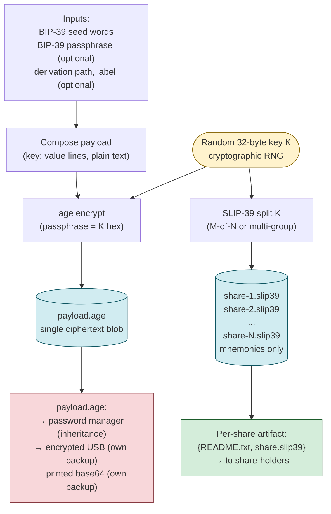
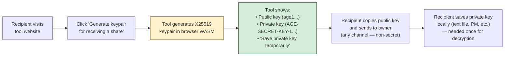
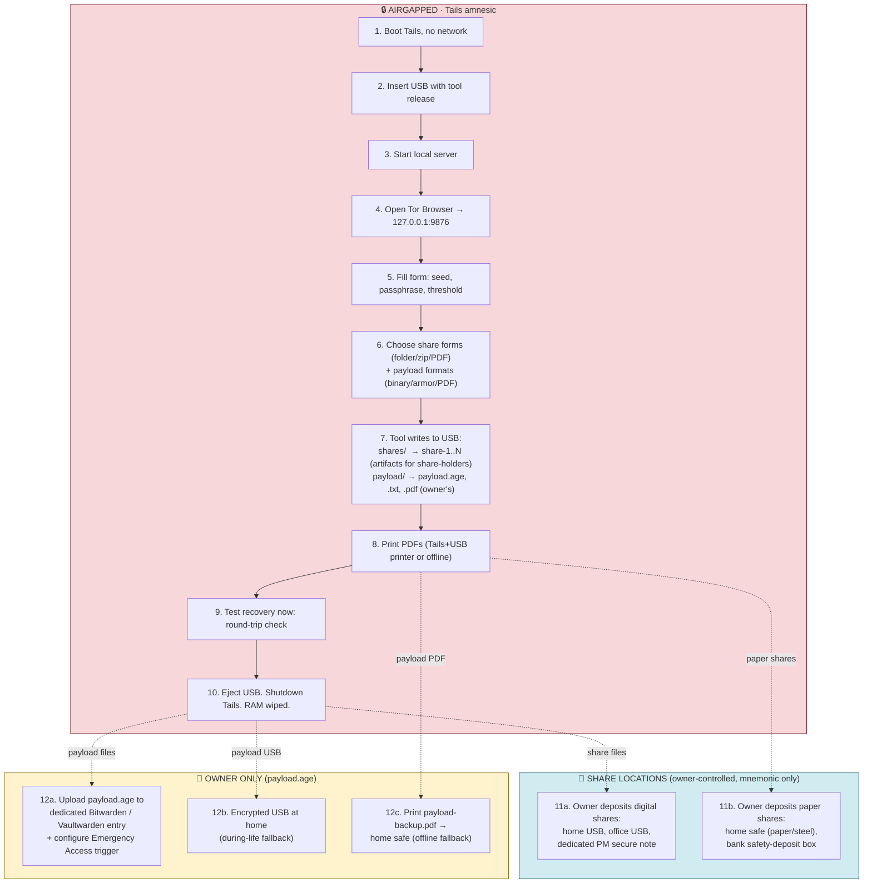

# SLIP-39 + age Redesign — Design Document

**Date:** 2026-05-21
**Status:** HISTORICAL. Implemented, then partly superseded. Do not follow the
storage guidance in this document.
**Repo:** slip39-backup (named Seed-Phrase-Storage-SLIP39 at the time)
**Branch:** `design-slip39-age-redesign`

> **Read this before acting on anything below.** This is the original design
> record, kept for its reasoning rather than as instruction. Two parts of it are
> now wrong:
>
> - **The artifact.** This document describes a single `payload.age` and tells the
>   owner to put it in a password manager, on a USB and in a safe. The bundle now
>   ships exactly one ciphertext, `payload.age.gpg.asc`, which is that age file
>   inside an OpenPGP AES-256 envelope. Shipping the unwrapped form beside it was
>   reversed as incoherent: it handed anyone who obtained the folder the weaker
>   file. See decision 2 in
>   [the decision record](../decisions/2026-08-09-envelope-entropy-and-implementations.md).
> - **The delivery.** The Kestrel host and Tor Browser flow here was replaced by a
>   native window and then by a Tauri shell. See
>   [2026-08-01](2026-08-01-native-window-appimage-design.md) and
>   [2026-08-09](2026-08-09-tauri-shell-and-styling-design.md).
>
> The SLIP-39 group and threshold model, the payload schema and the threat model
> still hold. Where this document and the decision record disagree, the decision
> record wins.

---

## 1. Summary

Redesign of the Seed-Phrase-Storage-SLIP39 tool around three principles:

1. **No proprietary encoding.** Every byte on every share is decodable using widely-implemented, multi-vendor standards (SLIP-39 + `age`). The tool's value-add is UX and assurance, not a new format. Recovery is possible via independent standard tools (iancoleman/slip39, any `age` CLI) even if this specific tool disappears.
2. **Two-layer envelope encryption.** A random 32-byte key K is split via SLIP-39 (threshold M-of-N); K encrypts a payload file containing the wallet secrets via `age`. The shares and the ciphertext blob are stored on independent paths — neither alone recovers the wallet.
3. **Self-administered as the default configuration.** The owner holds all shares across multiple owner-controlled locations (home USB, home safe, bank box, office, dedicated PM). Recovery is owner-sufficient and on-demand. A trust-distributed variant — shares held by other people — is documented for users who want it, but it is not the default.

Mechanism, in plain terms:

1. The wallet secrets (seed words + optional BIP-39 passphrase + derivation path + label, possibly multiple cosigner entries) are written into a plaintext payload **only briefly, in memory, inside the airgapped tool**.
2. The tool generates a random 32-byte key K.
3. The tool **encrypts the payload with K using `age`** → produces `payload.age` (a ciphertext blob, indistinguishable from random without K).
4. The tool **SLIP-39-splits K** into N shares with M-of-N threshold (default 3-of-5, single group).
5. **Two independent distribution flows result:**
   - **Key shares** (each a single SLIP-39 mnemonic) are stored at N distinct locations. In the self-administered default these are all owner-controlled (encrypted USB, home safe, bank box, office, dedicated PM secure note). In the trust-distributed variant some or all shares are held by other people.
   - **`payload.age`** is stored **separately, under owner control** — primarily in a dedicated password manager (Bitwarden or Vaultwarden) with an inheritance trigger configured to deliver it to the executor, plus 1–2 redundant copies on owner-controlled media (encrypted USB, printed PDF).
6. The plaintext payload is wiped from memory.

To recover: gather M shares from their locations → reconstruct K via the tool's Recoverer mode (or any standard SLIP-39 tool such as iancoleman/slip39 as fallback) → obtain `payload.age` from the PM inheritance pipeline or any user-controlled backup → use the tool or any standard `age` implementation to decrypt → read the wallet secrets.

**No plaintext secrets ever leave the airgapped tool.** Decentralizing the key via SLIP-39 while centralizing the ciphertext distribution via the PM gives a clean separation:

> **SLIP-39 distributes the *right to decrypt*; the password manager distributes the *thing to decrypt*.** Both are required.

An attacker who compromises M share locations has the key K but no ciphertext — they cannot recover the wallet. An attacker who breaches the PM has ciphertext but no key — they cannot recover the wallet either. Both layers must fail (or both be compromised) for the wallet to be lost.

This is the standard "envelope encryption with threshold key wrapping" pattern — analogous to how cloud HSMs (AWS KMS, GCP KMS) protect data, except the Key Encryption Key is split via SLIP-39 instead of held in hardware.

The current tool's design embeds the BIP-39 passphrase into the SLIP-39 master_secret via a `[entropy][passphrase][padding]` convention. That encoding is proprietary, ceiling-bumps at 32 bytes (24-word seeds + any passphrase exceed it), and forces recovery tools to know the convention. This redesign deletes that convention entirely.

### 1.1 What is `age`?

`age` (pronounced "ah-gay", from "actually good encryption") is a small modern file-encryption format and CLI tool created by Filippo Valsorda, with a published specification at https://age-encryption.org/v1. It plays the role GPG played 20 years ago but with a tiny, well-defined format instead of GPG's sprawl. Properties relevant to this design:

- **Multiple independent implementations** in Go (reference: `filippo.io/age`), Rust (`rage`), Python (`pyage`), JavaScript (`typage`). No single-vendor dependency.
- **~5-page spec** — short enough that a programmer can reimplement from spec alone if all current tools vanished.
- **Passphrase mode** uses `scrypt` for key derivation and ChaCha20-Poly1305 for authenticated encryption — both standard, both available in every mainstream language's crypto library.
- **Already packaged** in Debian, Ubuntu, Homebrew, Tails, Arch, Fedora. Heir can install it with `apt install age` on a Tails recovery session.
- **MIT licensed**, actively maintained, ~18k GitHub stars (as of 2026).

In this design, `age` is used in **passphrase mode**: the 32-byte SLIP-39 master_secret (hex-encoded) acts as the passphrase. No public/private keys, no agent, no key management — just a symmetric encrypt-with-passphrase that any age implementation handles uniformly.

---

## 2. Threat model

### 2.1 What this tool protects against

**This tool is recovery insurance, not a coercion-resistant vault.** It exists so that the user can rebuild their wallet from a sharded backup if the working setup is gone. Concrete events it protects against:

- **Catastrophic loss of the working hardware-wallet setup.** Fire, theft, water damage, hardware failure, forgotten PIN, lost device.
- **Tool/vendor disappearance over a multi-decade horizon.** Shares stored in 2026 must be recoverable in 2046 even if:
  - This repository is gone from GitHub.
  - Xecrets.Slip39 is unmaintained.
  - The .NET 10 toolchain no longer builds the Blazor WASM artifact.
  - Trezor as a company no longer exists.
- **Single-location compromise (digital or physical).** A single cloud account breach, single share-holder going rogue, or a single home break-in cannot yield the wallet — threshold + separate `payload.age` storage means a single point of exposure reveals nothing.
- **Inheritance.** The executor of the estate can recover the wallet through the PM Emergency Access trigger + the executor recovery manual.

**Defence**: the data on every share must be decodable from **the published specifications of widely-implemented standards** (SLIP-39, `age` v1) using **any one of multiple independent implementations**, by **anyone with basic technical skills** following printed recovery instructions stored with each share.

### 2.2 What this tool does NOT protect against

These are real concerns for Bitcoin self-custody, but they belong at a different layer than this backup tool:

- **Coercion of an active wallet operator ("$5 wrench attack").** If an attacker has the owner under physical duress while the working hardware wallets are accessible, the backup is not the attack target — the hardware wallets are. The attacker would force unlock of the devices and sign a draining transaction. Coercion defense is a wallet-design concern: multisig with cosigner-distribution, decoy passphrases on hardware wallets, hot/cold wallet separation, multivendor key diversity. None of these are properties this backup tool provides or relies on; they live in how the wallet itself is structured.
- **Attacks above the SLIP-39 threshold.** If an attacker assembles M-of-N shares AND obtains `payload.age`, they recover the wallet. By design. The threshold IS the access policy.
- **Side-channel attacks on the share-generation machine.** Mitigated by running on Tails; the design assumes the airgapped environment is uncompromised at the moment of generation.
- **Operator error.** Owner who stores all shares + `payload.age` in one location, forgets the threshold structure, loses the verification record — outside the tool's defense. The recommended setup (§4.3, §5.7) and the audit procedures (§A.3) exist to make these failures unlikely.

### 2.3 Position relative to wallet design

This tool **composes with** the user's chosen wallet architecture; it doesn't dictate it. The tool backs up whatever seed material the user has — single-sig BIP-39, multivendor multisig with multiple cosigner seeds, BIP-39 seed with multiple passphrase contexts. The wallet's spending policy (signature requirements, timelocks, descriptor structure) is outside the tool's scope and continues to do its job independently.

In particular, **if the user is concerned about coercion attacks, the answer is not at the backup layer** — it's in how their wallet is structured (e.g., multivendor multisig with cosigner devices physically distributed, decoy passphrases, etc.). This tool's job is to ensure that wallet, once chosen, survives catastrophic loss.

---

## 3. Design philosophy

### 3.1 Interop over invention

Every artifact the tool produces must be readable by tools that exist independently of this repo. Concretely:

- SLIP-39 shares are emitted as standard mnemonics that any SLIP-39 implementation accepts (`trezor/python-shamir-mnemonic`, `ilap/slip39-js`, Xecrets.Slip39, Trezor firmware, Keystone, OneKey, etc.).
- Encryption uses the **age v1 format** (https://age-encryption.org/v1) — a small, well-specified format with reference implementations in Go (filippo.io/age), Rust (rage), Python (pyage), and JavaScript (typage).
- The payload inside `age` is **human-readable plain text** (key-value, see §5.3) so the heir doesn't need a JSON parser, schema validator, or any tool beyond a text editor after decryption.

### 3.2 Multi-tool recovery is fine, hidden conventions are not

The recovery procedure requires two tools (a SLIP-39 implementation + an `age` implementation). That's acceptable because:

- Both tools are widely available and have multiple independent implementations.
- The recovery README in every share spells out exactly which tools to use and where to get them.
- The alternative — a single all-in-one tool — creates the single-tool dependency we're trying to avoid.

What's **not** acceptable: any decoding step that requires reading source code, reverse-engineering a binary format, or knowing an undocumented byte layout.

### 3.3 The tool produces files, not just words

Today's tool prints SLIP-39 mnemonics + QR codes for paper backup. The redesign extends this with **share folder artifacts** — each a small zip containing the SLIP-39 mnemonic, the encrypted payload, and the recovery README. These folders are designed for digital transmission (Signal, encrypted email, cloud) as easily as for paper printing.

### 3.4 Both directions in the tool

The tool supports **split (backup creation)** and **recover (wallet reconstruction)** flows. A user who still has the tool around can do one-click recovery. A user who doesn't — or an heir — falls back to the documented two-tool standard recovery procedure.

---

## 4. Architecture

### 4.1 High-level dataflow



ASCII fallback (same dataflow, for plain-text viewers):

```
                ┌─────────────────────┐
   Inputs:      │  BIP-39 seed words  │
                │  BIP-39 passphrase  │
                │  (optional metadata)│
                └──────────┬──────────┘
                           │
                           ▼
                ┌──────────────────────┐
                │  Compose payload     │   plain text
                │  (key: value lines)  │
                └──────────┬───────────┘
                           │
                           ▼
                ┌──────────────────────┐         ┌────────────────┐
   Random 32B ─►│  age encrypt         │────────►│  payload.age   │── to PM
   key K        │  (passphrase = K)    │         │  (one blob)    │   + own backups
                └──────────┬───────────┘         └────────────────┘
                           │
                           ▼
                ┌──────────────────────┐         ┌────────────────┐
                │  SLIP-39 split K     │────────►│  share-1.slip39│── to share-holder 1
                │  (M-of-N or          │         │  share-2.slip39│── to share-holder 2
                │   multi-group)       │         │  ...            │   ...
                └──────────────────────┘         └────────────────┘
```

**Key separation:** the encrypted blob and the SLIP-39 mnemonics travel different paths. Share-holders never receive the blob. The blob never sees the share-holders.

### 4.2 Why "share K, then encrypt payload with K" not "split the payload directly"

Plain Shamir's Secret Sharing over arbitrary-length payloads is possible (byte-by-byte split), but **no widely-deployed tool implements it interoperably**. SLIP-39 is the only well-supported SSS variant with a clean cross-vendor ecosystem, and its master_secret is capped at 32 bytes.

By using SLIP-39 only to share a 32-byte key, we get:

- All the SLIP-39 ecosystem benefits (iancoleman, Trezor, Keystone, etc.).
- No 32-byte ceiling on the actual payload — passphrase, derivation path, metadata, all fit.
- Clean separation of concerns: SLIP-39 handles thresholding, `age` handles the symmetric crypto.

### 4.3 Distribution flow — two independent paths

The tool produces two kinds of output that travel different paths:

- **N share artifacts** — each contains *only* a SLIP-39 mnemonic + a short README. Tiny (~200 bytes). Stored across multiple locations (digital, paper, mixed).
- **One `payload.age`** — the encrypted wallet data. Stays under the user's control. Goes to a dedicated PM with inheritance trigger + 1-2 redundant copies on user-controlled media.

#### Default: self-administered distribution

The recommended default configuration is **self-administered**: the owner holds all N shares across multiple locations they control. This means the owner can reconstruct the wallet alone, anytime, without coordinating with anyone else. Threshold protects against single-location loss (fire, theft, hardware failure at any one place), but it doesn't require third parties for normal recovery.

A typical 3-of-5 self-administered distribution:

```mermaid
flowchart TB
    Gen(["Tails — offline<br/>Generate split<br/>3-of-5 threshold"])

    Gen -->|payload.age<br/>(1 blob)| Blob[("payload.age")]
    Gen -->|5 SLIP-39 mnemonics| Split{ }

    Split --> S1["share-1<br/>📦 zip"]
    Split --> S2["share-2<br/>📄 paper"]
    Split --> S3["share-3<br/>📄 paper"]
    Split --> S4["share-4<br/>📦 zip"]
    Split --> S5["share-5<br/>📦 zip"]

    S1 --> L1["Encrypted USB<br/>at home"]
    S2 --> L2["Home safe<br/>(paper/steel plate)"]
    S3 --> L3["Bank safety-deposit box<br/>(out-of-town if possible)"]
    S4 --> L4["Office or second residence"]
    S5 --> L5["Dedicated PM secure note"]

    Blob --> PM["Dedicated password manager<br/>(Bitwarden/Vaultwarden)<br/>with Emergency Access trigger<br/>→ executor for inheritance"]
    Blob --> OwnUSB["Encrypted USB<br/>at home<br/>(during-life fallback)"]
    Blob --> OwnPrint["Printed PDF in home safe<br/>(offline fallback)"]

    style Blob fill:#f8d7da,stroke:#721c24
    style PM fill:#f8d7da,stroke:#721c24
    style OwnUSB fill:#f8d7da,stroke:#721c24
    style OwnPrint fill:#f8d7da,stroke:#721c24
    style S1 fill:#d1ecf1,stroke:#0c5460
    style S2 fill:#fff3cd,stroke:#856404
    style S3 fill:#fff3cd,stroke:#856404
    style S4 fill:#d1ecf1,stroke:#0c5460
    style S5 fill:#d1ecf1,stroke:#0c5460
```

**Recovery requires:** any 3 of the 5 mnemonics (from any mix of locations) PLUS the `payload.age` (from PM inheritance pipeline or any user-controlled backup). Both layers are required; neither alone yields the wallet.

ASCII fallback (same distribution, for plain-text viewers):

```
                          ┌──────────────────────┐
                          │  Tails — offline     │
                          │  Generate split      │
                          │  (3-of-5 threshold)  │
                          └──────┬───────┬───────┘
                                 │       │
              5 SLIP-39 mnemonics│       │ payload.age (single blob)
                                 │       │
       ┌─────────────────────────┘       └────────────────────┐
       │                                                       │
       ▼                                                       ▼
  ┌──────────────────────────────────┐         ┌──────────────────────────────┐
  │ Share paths (mnemonics only)     │         │ Ciphertext path (owner only) │
  └─────┬────────────────────────────┘         └─────┬────────────────────────┘
        │                                            │
        ├── share-1.zip   → Encrypted USB at home    ├── Dedicated PM with
        ├── share-2.pdf   → Home safe (paper/steel)  │   Emergency Access
        ├── share-3.pdf   → Bank safety-deposit box  │   (→ executor for inheritance)
        ├── share-4.zip   → Office / 2nd residence   ├── Encrypted USB at home
        └── share-5.zip   → Dedicated PM secure note │   (during-life fallback)
                                                     └── Printed PDF in home safe
                                                          (offline fallback)

   Recovery requires BOTH:
     (a) any 3 of the 5 mnemonics (in any mix of digital/physical)
     (b) one copy of payload.age (from PM or any user-controlled backup)

   Neither alone yields the wallet. M-of-N protects the key K;
   PM + redundant own-backups protect the ciphertext.
```

#### Why this mix

The default uses **2 digital + 2 paper + 1 PM** for diversity of failure modes:

- A coordinated online attack (all PMs compromised, all clouds breached) still misses the paper shares.
- A coordinated physical attack (home + safety-deposit box hit) still misses the digital ones.
- A pure-cloud event (PM goes out of business) still leaves four other locations untouched.
- Multiple substrates means no single technology aging-out (USB flash decay, paper fire) takes everything.

#### Variant: trust-distributed (some shares with other people)

For users who want defense against scenarios the self-administered configuration doesn't address — primarily, scenarios where the owner has been incapacitated and the executor needs to recover without owner cooperation — some or all shares can be held by trusted people instead of (or in addition to) owner-controlled locations.

This variant is documented but **not the default**. The trade-offs are:

- Defense added: an attacker who compromises the owner alone cannot reach threshold without also reaching third parties.
- Cost added: ongoing coordination (annual audits with each share-holder, briefings on duress protocols if applicable, social cost of asking people to hold something for decades).
- Inheritance still relies on the PM Emergency Access trigger to deliver `payload.age` to the executor; trust-distributed shares change who holds the SLIP-39 shares, not how the ciphertext reaches the heir.

For users with high-visibility public Bitcoin profiles or specific concerns about long-term coercion threats, trust-distributed makes sense. For most personal cold-storage use, self-administered is sufficient and dramatically simpler operationally.

---

## 5. Container format

### 5.1 The share artifact (digital share)

Each digital share contains **only** the SLIP-39 mnemonic and a short README. **It does NOT contain `payload.age`.** The encrypted payload travels a separate path (see §5.7).

```
share-2-of-3/
├── README.txt          (short note for the recipient + recovery procedure)
└── share.slip39        (SLIP-39 mnemonic, 20 or 33 words)
```

Each share is tiny — under 1 KB total. Easily attached to a Signal message, an email, or a cloud share link.

#### Visual: contents of one digital share

```
╔══════════════════════════════════════════════════════════╗
║  share-2-of-3.zip            (~600 bytes total)          ║
║  ────────────────────────────────────────────            ║
║                                                          ║
║  📄  README.txt              ~40 lines, plain text       ║
║      What this file is, and what the heir needs to do    ║
║      with it during a recovery. Does NOT contain the     ║
║      encrypted blob — points the recoverer to where to  ║
║      get it (PM inheritance, or owner's offline copy).   ║
║                                                          ║
║  📄  share.slip39            ~150 bytes, 1 line          ║
║      The SLIP-39 mnemonic for THIS share (20 or 33       ║
║      words). UNIQUE per share. This alone reveals        ║
║      ZERO bits of the encryption key — useless without   ║
║      enough other shares to meet the threshold AND       ║
║      access to payload.age.                              ║
║      Example:                                            ║
║        abandon ability able about above absent absorb    ║
║        abstract absurd abuse access accident acid        ║
║        acoustic acquire across action actor actress      ║
║        actual                                            ║
║                                                          ║
║  ❌  NO payload.age          The encrypted blob lives    ║
║                              in the owner's password     ║
║                              manager (with inheritance   ║
║                              trigger) and their own      ║
║                              offline backups. NOT here.  ║
║                                                          ║
╚══════════════════════════════════════════════════════════╝
```

### 5.2 The SLIP-39 mnemonic file

A plain-text file. Single line, words separated by single spaces, no leading/trailing whitespace beyond a final newline.

```
abandon ability able about above absent absorb abstract absurd abuse access accident acid acoustic acquire across action actor actress actual
```

Standard SLIP-39 mnemonic. Acceptable by any compliant implementation.

### 5.3 The encrypted payload — `payload.age`

A standard age v1 file in passphrase mode. The passphrase is the **hex encoding of the 32-byte SLIP-39 master_secret** (64 lowercase hex characters).

The decrypted plaintext is a UTF-8 text file with the following format:

The schema uses a `cosigners:` array as the canonical structure. Every wallet — single-sig, shared-seed-multi-passphrase, or independent multivendor multisig seeds — is expressed as one or more entries in this array. The seed itself is hoisted to the top level when shared across all entries; otherwise each cosigner can carry its own.

**Single-sig (the common case):**

```
schema_version: 1.1
created: 2026-05-21T14:32:00Z
label: "Main wallet"

seed_words: abandon ability able about above absent absorb abstract absurd abuse access accident

cosigners:
  - id: main
    wallet_type: bip39
    passphrase: optional UTF-8 string here (omit field entirely if no passphrase)
    derivation_path: m/84'/0'/0'

threshold: 3-of-5
slip39_extendable: true
notes: |
  Set up on 2026-05-21 using SPS-SLIP39 v2.0.
  Wallet imported into Sparrow as a native segwit single-sig.
```

**Shared-seed multisig (one seed, multiple passphrases for cosigner keys):**

```
schema_version: 1.1
created: 2026-05-21T14:32:00Z
label: "2-of-2 shared-seed multisig wallet"

seed_words: abandon ability able about above absent absorb abstract absurd abuse access accident

cosigners:
  - id: cosigner_a
    wallet_type: bip39
    passphrase: passphrase-for-cosigner-a
    derivation_path: m/48'/0'/0'/2'
    xpub_fingerprint: 7a3f9c2d
  - id: cosigner_b
    wallet_type: bip39
    passphrase: passphrase-for-cosigner-b
    derivation_path: m/48'/0'/0'/2'
    xpub_fingerprint: 4e5cb619

descriptor: wsh(sortedmulti(2, [7a3f9c2d/48'/0'/2']xpub_A/*, [4e5cb619/48'/0'/2']xpub_B/*))

threshold: 3-of-5
slip39_extendable: true
```

**Multivendor multisig (independent seeds per cosigner, all backed up together):**

```
schema_version: 1.1
created: 2026-05-21T14:32:00Z
label: "2-of-3 multivendor multisig (Trezor + Coldcard + Jade)"

# No top-level seed_words — each cosigner has its own
cosigners:
  - id: trezor
    wallet_type: bip39
    seed_words: abandon ability able about above absent absorb abstract absurd abuse access accident
    derivation_path: m/48'/0'/0'/2'
    xpub_fingerprint: 7a3f9c2d
  - id: coldcard
    wallet_type: bip39
    seed_words: about above absent absorb abstract absurd abuse access accident acid acoustic acquire
    derivation_path: m/48'/0'/0'/2'
    xpub_fingerprint: 4e5cb619
  - id: jade
    wallet_type: bip39
    seed_words: acquire across action actor actress actual adapt add addict address adjust admit
    derivation_path: m/48'/0'/0'/2'
    xpub_fingerprint: 9c1e3b58

descriptor: wsh(sortedmulti(2, [7a3f9c2d/...]xpub_T/*, [4e5cb619/...]xpub_C/*, [9c1e3b58/...]xpub_J/*))

threshold: 3-of-5
slip39_extendable: true
```

Notes on the format:

- Hand-written, human-readable. The heir can open it in any text editor.
- The format is **a small YAML-like subset** that the tool parses directly. The heir does *not* need a YAML library — the format is simple enough to read by eye. The tool emits and parses it without depending on any external YAML/JSON/CBOR library.
- Keys are lowercase snake_case with `: ` separator (one space after colon).
- Multi-line values use `|` followed by indented continuation lines (a YAML convention; the README's recovery instructions explain it inline so the heir doesn't need prior YAML knowledge).
- Empty lines and `#` comments are tolerated by the parser but not emitted by the tool.
- **Required fields:** `schema_version`, `cosigners` (at least one entry), each cosigner needs either a top-level `seed_words` or its own `seed_words`.
- **No passphrase:** if a cosigner has no BIP-39 passphrase, the `passphrase` field is omitted entirely (not emitted as `passphrase: ` empty). The heir interpreting the file should treat the absence of the field as "no passphrase."
- `descriptor` is non-secret but useful — captures the wallet's spending policy (multisig structure). Without it, even with all cosigner seeds recovered, the executor doesn't know how to reconstruct the multisig wallet.
- `schema_version: 1.1` is the current version. Schema v1.0 (single `wallet_type` + `seed_words` at top level, no `cosigners:` array) is **deprecated** but tools should accept it as a legacy format equivalent to a single-cosigner v1.1 payload.

### 5.4 The recovery README — `README.txt`

A plain-text file. ~80 lines. Contents per share:

1. **Identification line** — share index and group (e.g., "Family share 3 of 6").
2. **For the recipient** (1 paragraph) — "Keep this file safe, don't open it, this alone reveals nothing."
3. **For the recoverer** (the rest) — step-by-step recovery procedure.

Full text template in §7.4.

### 5.5 The bundled zip option

For digital transmission, the tool emits each share folder as a zip:

```
share-2-of-3.zip   (≈600 bytes)
└── share-2-of-3/
    ├── README.txt
    └── share.slip39
```

Zip is mainly for convenience (single attachment instead of two files); compression isn't meaningful at this size. No password protection on the zip — the SLIP-39 mnemonic on its own is cryptographically useless, so additional encryption at the zip layer adds no security and complicates transmission.

### 5.6 The paper variant (physical share)

For shares stored offline on paper, metal, in safety deposit boxes, etc., the tool generates a **printable PDF** containing the SLIP-39 mnemonic and recovery instructions only. **No `payload.age` on paper shares** — the encrypted blob lives on user-controlled storage (§5.7), not in share-holder hands.

**Each paper share is one PDF, 2 pages, designed to be printed on standard A4/Letter.**

#### Page 1 — Identity + the SLIP-39 mnemonic

```
┌──────────────────────────────────────────────────────────────┐
│                                                              │
│   SLIP-39 SHARE BACKUP — Family share 3 of 6                │
│   Created: 2026-05-21      Tool: SPS-SLIP39 v2.0            │
│                                                              │
│   Threshold structure:                                       │
│     • Group threshold: 2 of 4 groups must contribute        │
│     • Personal #1   1-of-1                                   │
│     • Personal #2   1-of-1                                   │
│     • Friends       3-of-5                                   │
│     • Family        2-of-6  ◄── this share belongs here     │
│                                                              │
│   ═══════════════════════════════════════════════════════    │
│   SLIP-39 Mnemonic for this share                            │
│   ═══════════════════════════════════════════════════════    │
│                                                              │
│      1. abandon       8.  abstract     15. acquire           │
│      2. ability       9.  absurd       16. across            │
│      3. able         10.  abuse        17. action            │
│      4. about        11.  access       18. actor             │
│      5. above        12.  accident     19. actress           │
│      6. absent       13.  acid         20. actual            │
│      7. absorb       14.  acoustic                           │
│                                                              │
│                       ┌──────────────────┐                  │
│                       │  ▓▓▓░▓▓░░▓▓░▓▓░ │                  │
│                       │  ░▓▓░▓░▓▓░▓░░▓░ │                  │
│                       │  ▓░▓▓░▓▓░░▓▓▓▓░ │                  │
│                       │  ▓▓░░▓░▓░▓░▓░▓░ │                  │
│                       │  ░▓▓▓░▓▓░▓▓░░▓▓ │                  │
│                       └──────────────────┘                  │
│                       QR of the 20 words above              │
│                       (for scanner-based entry)              │
│                                                              │
│   Verify: when scanned, the QR contains the exact text:     │
│   "abandon ability able about above absent absorb           │
│    abstract absurd abuse access accident acid acoustic      │
│    acquire across action actor actress actual"              │
│                                                              │
│                                                  Page 1 of 2 │
└──────────────────────────────────────────────────────────────┘
```

#### Page 2 — Recovery instructions

Identical content to the `README.txt` of the digital variant, formatted for print (see §7.4 for the template). Includes:

- Identification of this share (group + index).
- Threshold structure.
- **Critical note: where to obtain `payload.age`** — pointer to the owner's PM inheritance pipeline and/or the executor's instructions and/or owner's own offline backups.
- Step-by-step recovery procedure.
- Alternative tools list.
- Spec references for last-ditch reimplementation.

#### Physical media options for paper shares

The PDF is print-output. The user chooses the actual physical substrate independently:

- **Standard printer paper** in a tamper-evident envelope. Cheapest. Vulnerable to fire, water, decay.
- **Acid-free archival paper**. Decades-stable in dry storage.
- **Steel/titanium plates** with the SLIP-39 mnemonic stamped (e.g., Cryptosteel, Coldcard Mk4 plates, Blockplate). Survives fire and water. Because the paper share now carries only the mnemonic, the plate alone covers the share — no companion paper is needed.
- **Etched on metal foil** for archival. Specialist option.

The tool doesn't dictate the substrate. It produces the PDF; the user prints, transcribes, or stamps as appropriate to their threat model and budget.

### 5.7 Where `payload.age` is stored — operational guidance

*This section is operational guidance, not a tool feature. The tool produces `payload.age`; where the user stores it and how they configure inheritance is a separate operational decision. Below are the recommended patterns; any other storage that meets the same properties (encrypted-at-rest, redundantly held, accessible by the executor through some mechanism) works equally well.*

The encrypted blob lives entirely under the **owner's control**. It is never sent to share-holders. The recommended setup is one primary inheritance pipeline plus two redundant own-control copies — so the blob survives any single channel's failure.

#### Primary: dedicated password manager with inheritance trigger

The blob's primary distribution path to heirs is a **dedicated password manager entry** with an inheritance / dead-man-switch trigger configured. When triggered, the PM delivers the blob (and an instruction note) to designated heirs.

Recommended PMs and their relevant features as of 2026:

| Password manager | Inheritance feature | Self-host option | Notes |
|---|---|---|---|
| **Bitwarden** (cloud) | Emergency Access — grant N-day-delayed access to specific trustees. Free tier supports this. | No (cloud-only) | Most user-friendly; widely available. Trustee receives full vault access after delay. |
| **Vaultwarden** (self-hosted, Bitwarden-compatible) | Emergency Access (same as Bitwarden). | **Yes** — self-hosted on your own server / VPS. | Best for users who already self-host. Backups under your control. Requires you to set up the server. |
| **1Password** | Emergency Kit (paper PDF) + Family Plan recovery. Custodian role. | No | Polished UX. The "Emergency Kit" is itself a recovery path your heir can use. |
| **Proton Pass** | No formal inheritance feature as of 2026; heir would need account credentials. | No | Avoid for this use case unless features improve. |
| **KeePassXC** | None built in. Manual: share the encrypted .kdbx file with a trusted custodian + provide them the master password via a separate mechanism. | **Yes** — file-based, no server. | Most under your control, least convenient. Good as a *secondary* backup, not primary. |

**Recommended choice for most users: Bitwarden Emergency Access** (or **Vaultwarden** if you're a self-hosting type). It's free, well-documented, the inheritance UX is unambiguous, and the trustee gets a clear notification + delay window.

#### Setting up the PM entry

The blob lives as a single secure-note or attachment in the PM, in a **dedicated entry** used for nothing else:

```
Entry name:  "Bitcoin wallet payload.age — for executor"
Type:        Secure Note (or attachment, see below)
Content:     [ASCII-armored payload.age — see encoding below]
Notes:       "Do not delete. Required for wallet recovery.
              See instruction manual in [physical location].
              SLIP-39 shares held by: [executor's instructions]."
```

If the PM supports file attachments (Bitwarden / 1Password do), attach `payload.age` directly as the binary file. Otherwise, store the ASCII-armored content as a secure note.

**Inheritance configuration:**

- Trustees: your executor + 1 backup person (in case primary executor is unavailable).
- Wait time: a delay long enough to prevent surprise activation but short enough for actual emergencies — typically 7 to 30 days.
- Test the trigger annually. Bitwarden lets you initiate a test, then cancel — confirms the trustee got the notification.

#### Redundant own-control backups

The PM is a single point of failure. Add at least **two more copies** under your own control:

1. **Encrypted USB at home.** A small USB stick containing `payload.age` plus a copy of the instruction manual. Use full-disk encryption (VeraCrypt, LUKS). The unlock password lives in the same PM entry as a separate field. This is your *during-life* fallback — if the PM disappears, you can still recover yourself.

2. **Printed paper backup in a home safe.** `payload.age` printed as ASCII armor (or base58 — see below) plus a QR code, on archival paper, in a tamper-evident envelope in a fireproof home safe. This is the offline/post-cloud-collapse fallback.

These two copies are *your* insurance against PM failure. They are NOT distributed to share-holders. They live wherever you alone have routine access.

Optional third copy for further redundancy: a second PM (e.g., self-hosted Vaultwarden alongside Bitwarden cloud) holding the same blob. Useful if you don't trust any single PM provider's longevity.

#### Encoding for printed / typed-in copies — `age` ASCII armor vs base58

`payload.age` is a small binary file (~300–500 bytes). For paper backup and PM secure-note storage, encode it as ASCII so it can be typed or scanned.

**Recommended: `age` ASCII armor** — the format `age --armor` produces directly:

```
-----BEGIN AGE ENCRYPTED FILE-----
YWdlLWVuY3J5cHRpb24ub3JnL3YxClNjcnlwdC9iSDNyVUZpVE9SUW9UV3RHbHZS
Mlh3IDE4Cjk2cFE5VEdGTU1ZdHFPdmtaSDFuc3VAZUVRY29Hb1JmRlcrSDRSekRo
UQpJYTQ5N1JxL1JzbUtKVUVEZmZBVlpVcEJzc1ZpQ0E4UWxBSlh5L05vTGpKQUlS
elhEYy90RU0KLS0tIE5lOFh6OUcvUmZTaC9hM1l6ZW1qd1F5RGdNUm1OS3M1Rmcg
c2hwLzNiNlk0OXRwQ2lJWHJOR2tVS2hKaW5tVi9JOGowdDk2NXZEbnRNNHpwa1B6
cTFhRXFKSEpZWmRsTjAyVlZBMm9oTzhETjJjPQ==
-----END AGE ENCRYPTED FILE-----
```

Why ASCII armor:

- **Native age format**: `age -d payload.age.txt` accepts it directly. No decode step.
- **Copy-paste friendly**: heir copies block from PM secure note into a text file, runs `age -d`. Done.
- **PEM-style fences** make it visually distinct and hard to confuse with anything else.
- Available everywhere `age` itself is available; no extra tool needed.

**Alternative: base58 with separate file output.** Base58 (Bitcoin's encoding) avoids the visually-ambiguous characters in base64 (`0/O`, `I/l`, `+/=`), so it's friendlier for hand-transcription from paper. Trade-off: the heir needs to base58-decode first, then save as `payload.age`, then run `age -d`. Extra step requires a base58 tool (any Bitcoin wallet's debug console, or `base58` CLI). Recommended only if you specifically expect hand-transcription as a likely recovery path — e.g., if the paper backup is your *primary* path rather than the PM.

**For QR codes**: encode the ASCII armor directly. Standard QR readers return the text, paste into a file, decrypt. No double encoding needed.

#### What gets stored where, summary

| Storage | Form | Purpose | Who can access |
|---|---|---|---|
| Dedicated PM with inheritance trigger | `payload.age` as secure note or attachment | Primary heir-delivery path | Owner during life; heirs after trigger |
| Encrypted USB at home | `payload.age` binary + instruction manual | During-life fallback if PM fails | Owner only |
| Printed paper in home safe | `payload.age` as ASCII armor (or base58) + QR | Offline fallback against cloud-era collapse | Owner; executor accesses via key to safe |
| (optional) Second PM | `payload.age` duplicate | Defense against single-PM-vendor failure | Owner; secondary heir path |
| Share-holders | **nothing related to `payload.age`** | — | — |

### 5.8 Transit encryption with tool-generated recipient keypairs

Sending a share to a share-holder over a channel (Signal, email, cloud) is the single moment when the share artifact crosses an untrusted boundary. To make this transit unconditionally confidential — even if the channel is wiretapped, even if your own machine has a passive observer watching outbound traffic — the tool supports **asymmetric encryption per recipient using `age` recipient mode**.

Crucially, **the tool also generates the recipient's keypair**, so each share-holder does NOT need to know what `age` is, install any CLI, or manage SSH keys. They simply visit the tool's website, click a button, and receive their keypair.

#### The two-mode tool

The same SPS-SLIP39 web app runs in two modes, distinguished by which page the user opens:

| Mode | Audience | Where it runs | What it does |
|---|---|---|---|
| **Owner mode** | Wallet owner | Tails, airgapped | Splits seed → SLIP-39 shares + payload.age. Encrypts each share artifact with a specific recipient's public key (if provided). |
| **Recipient mode** | Share-holder | Their own browser, any device | Generates an age keypair locally. Displays the public key. Later, accepts an encrypted share file + their private key, and decrypts it to plain cleartext. |

Both modes are bundled in the same Blazor WASM application. The recipient mode page works without internet, contains no telemetry, and never transmits keys anywhere.

#### Setup flow



Important property: **the keypair never leaves the recipient's browser.** Generation is local WebAssembly. The recipient copies the public key text and sends it; the private key stays on their machine.

#### Encryption flow (owner side, on Tails)

The Owner-mode UI gains a "Recipient public key" field for each digital share. The owner pastes each recipient's `age1...` public key. When generating the share artifacts:

```
For share-N-of-M, if recipient public key is provided:
  - Bundle the share folder normally (README.txt + share.slip39)
  - Compress into share-N-of-M.zip
  - Encrypt: age -r <recipient-pubkey> -o share-N-of-M.age share-N-of-M.zip
  - Output: share-N-of-M.age (binary) and share-N-of-M.age.txt (armored)
```

The owner sends `share-N-of-M.age` (or the armored .txt) to the recipient via any channel. Even if the entire channel is logged by an adversary, all they see is age ciphertext bound to the recipient's public key. Only the recipient's private key can decrypt.

#### Decryption flow (recipient side)

```mermaid
flowchart LR
    D1["Recipient receives<br/>share-N-of-M.age<br/>via Signal/email/cloud"] --> D2["Visits tool website<br/>(any device, any time)"]
    D2 --> D3["Clicks 'Decrypt my share'"]
    D3 --> D4["Uploads encrypted file<br/>+ pastes private key"]
    D4 --> D5["Tool decrypts in browser<br/>(WASM, local)"]
    D5 --> D6["Tool displays the cleartext<br/>share folder contents:<br/>README.txt + share.slip39"]
    D6 --> D7["Recipient saves the<br/>cleartext share folder<br/>somewhere they trust"]
    D7 --> D8["Recipient discards<br/>the encrypted file<br/>and the private key"]

    style D5 fill:#fff3cd,stroke:#856404
    style D8 fill:#d4edda,stroke:#155724
```



#### Why the recipient discards the private key after first decryption

Per §5.7 of the previous discussion: the SLIP-39 share alone is cryptographically useless (it reveals zero bits of K), so encryption-at-rest on the recipient's side is protecting something that doesn't need protection. What matters is that the recipient can produce the cleartext share when the executor asks for it years later — and tying that to a private key the recipient has to keep alive for decades is a fragility we don't want.

So after the recipient has decrypted once and saved the cleartext share folder (in their normal documents, password manager, printed copy, whatever), the private key has done its one job and can be deleted. The recipient never needs to manage it long-term.

If the recipient later loses the cleartext share too — that's fine. SLIP-39 threshold tolerates the loss. The owner can re-issue from new shares if needed (during the owner's lifetime); if the owner is gone, the threshold protects against this single loss.

#### Recovery-time mirror — three-mode tool

The same trick applies in reverse during recovery, but in this direction the **recoverer** (the original owner doing self-recovery, OR an executor acting after the owner is gone) is the one publishing a public key, and the **share-holders** are the ones encrypting. The tool therefore needs a third mode in addition to Owner mode and Recipient mode:

| Mode | Audience | Where it runs | What it does |
|---|---|---|---|
| Owner mode | Wallet owner | Tails, airgapped | Splits seed, encrypts shares to recipient pubkeys, encrypts payload.age |
| Recipient mode | Share-holder receiving a share | Their own browser, any device | Generates keypair locally for receiving a share |
| **Sender mode** (new) | Share-holder sending a share BACK at recovery | Their own browser, normal online device | Accepts cleartext share + recoverer's public key → produces encrypted .age file to send back |

The tool combines all three modes in the same Blazor WASM app, with the entry-page UX letting the user pick which task they're doing.

#### Recovery flow, step by step

```mermaid
flowchart TB
    R1["1. Recoverer boots Tails (airgapped)"]
    R2["2. Tool's Recipient mode → 'Generate keypair'<br/>X25519 keypair created in Tails browser WASM"]
    R3["3. Recoverer saves private key to encrypted USB<br/>(or keeps Tails session alive throughout)"]
    R4["4. Recoverer notes public key (the age1... string)"]
    R5["5. Recoverer powers down Tails or steps away"]

    R6["6. Online machine: send pubkey to share-holders<br/>(Signal, email — pubkey is non-secret)"]
    R7["7. Each share-holder opens tool website<br/>on their normal online computer"]
    R8["8. They use 'Sender mode': upload their cleartext<br/>share + paste recoverer's pubkey"]
    R9["9. Tool produces share-N.age (encrypted to recoverer)"]
    R10["10. Share-holder sends share-N.age back<br/>via any channel"]

    R11["11. Recoverer collects threshold-many encrypted shares<br/>onto a USB stick"]
    R12["12. Boot Tails. Mount USB."]
    R13["13. Recoverer mode in tool:<br/>upload each share-N.age + their private key<br/>→ tool decrypts → cleartext SLIP-39 mnemonics"]
    R14["14. Tool combines threshold mnemonics → 32-byte key K"]
    R15["15. Tool decrypts payload.age with K<br/>→ shows seed words + passphrase"]

    R1 --> R2 --> R3 --> R4 --> R5
    R5 --> R6 --> R7 --> R8 --> R9 --> R10
    R10 --> R11 --> R12 --> R13 --> R14 --> R15

    style R1 fill:#f8d7da,stroke:#721c24
    style R5 fill:#f8d7da,stroke:#721c24
    style R12 fill:#f8d7da,stroke:#721c24
    style R7 fill:#d1ecf1,stroke:#0c5460
    style R10 fill:#d1ecf1,stroke:#0c5460
```



#### Two important properties of this flow

1. **Share-holders use the tool on a normal (online) computer.** They don't need Tails. They don't install anything. They visit a URL, paste a pubkey, upload their share, get an encrypted file. Friction is minimal — this matters because share-holders are non-technical people you're asking for help while you (or the original owner) are vulnerable.

2. **The recoverer's private key lives only on Tails.** It's generated in an amnesic browser WASM session and either persisted to an encrypted USB (using Tails Persistent Storage, or a separately-mounted LUKS/VeraCrypt volume), or — for a fast recovery — never persisted at all, with the Tails session kept alive throughout the gathering window. The encrypted shares can pass over any channel and through any number of intermediate machines on their way to Tails, because the only key that decrypts them is in the recoverer's Tails session.

#### "Or not, if it's not me" — the executor case

If the recoverer is not the original owner — i.e., it's the executor of the estate — they might reasonably skip Tails:

- They're using a clean, fresh, single-purpose laptop.
- They're acting once, recovering, transferring funds to a wallet under their control, and never touching the seed again.
- Their threat model doesn't include long-term surveillance — they're not the original target.

In that case, the executor can run the same tool on a clean offline-only Linux session (without going through full Tails). The cryptographic guarantees are unchanged — the private key still never touches the network, the encrypted shares only decrypt with that key. Tails just adds amnesia, which matters if the recoverer worries the machine itself is compromised.

The instruction manual (Appendix A) makes both paths explicit so the executor knows the simpler path is acceptable.

#### What this defends against, and what it doesn't

| Threat | Original (channel-only) | With tool-generated transit encryption |
|---|---|---|
| Passive wiretap on Signal/email/cloud | Relies on channel's E2EE | **Defeated** — observer sees only age ciphertext |
| Channel provider compromise | Share leaks | **Defeated** — provider cannot decrypt |
| Compelled access at the channel provider | Share leaks | **Defeated** — provider has only ciphertext |
| Owner-side malware sniffing outbound traffic | Share leaks | **Defeated** — outbound traffic is already ciphertext |
| Recipient-side malware sniffing during decryption | Share leaks | Still possible (mitigation: decrypt on a clean device) |
| Recipient is coerced after receipt | Share leaks | Still possible (cryptography can't fix coercion) |

#### Optional vs. default

In the owner-mode UI, recipient-mode transit encryption is **optional but default-on** for any digital share. If the owner doesn't supply a public key for a share, the tool falls back to channel-encryption-only (plain zip). For paper shares, transit encryption is moot (sealed envelope in hand).

The tool gives the owner a clear visual indicator per share — "🔒 Encrypted to recipient pubkey" vs. "Channel encryption only" — so they know what protections each share has.

---

## 6. Tool flows

### 6.1 Backup creation (split)

UI: a form with these fields, organized to match the payload schema (§5.3).

**Cosigners section** — repeatable group, default 1 cosigner (single-sig). User clicks "Add cosigner" for multisig configurations.

- **Cosigner ID** (free text label, e.g., "main", "trezor", "cosigner_a").
- **Seed words** (12 or 24 BIP-39 words). For shared-seed multisig, the first cosigner's seed is reused — UI offers a "use the same seed as cosigner #1" toggle for subsequent cosigners.
- **Passphrase** (optional, arbitrary UTF-8 string).
- **Derivation path** (optional, defaults to `m/84'/0'/0'` for native segwit single-sig, or `m/48'/0'/0'/2'` for multisig).
- **xpub fingerprint** (optional, for multisig — needed for the descriptor).

**Wallet metadata**:
- **Label** (optional, free text).
- **Descriptor** (optional, for multisig — the wallet's spending policy string).

**Threshold configuration**:
- Default: **3-of-5, single group, self-administered**.
- Collapsible "Advanced" section: multi-group SLIP-39 with per-group thresholds, trust-distributed configuration option.

**Output configuration**:
- **Output directory** (where artifacts are written).
- **Per-share format selection** — for each SLIP-39 share, the user picks one of three output forms:
  - **Folder** (raw `share-N-of-M/` directory).
  - **Zip** (`share-N-of-M.zip`, for digital transmission).
  - **PDF** (`share-N-of-M.pdf`, for printing — see §5.6).
  A "default all to X" quick-select speeds up the common case. The recommended self-administered mix is 2 zip + 2 PDF + 1 PM secure note (§4.3).
- **Recipient public keys** (optional, only relevant if shares are going to other people in the trust-distributed variant) — paste each recipient's `age1...` pubkey for transit encryption (§5.8). Leave blank for owner-controlled shares.
- **Ciphertext output format** — for `payload.age`, the user picks one or more of:
  - Binary file (`payload.age`) — for direct PM attachment, USB storage.
  - ASCII-armored text file (`payload.age.txt`) — for pasting into PM secure notes.
  - Printable PDF (`payload-backup.pdf`) — armored text + QR, for offline paper backup.

On submit:

1. Validate inputs (BIP-39 checksum, threshold bounds, etc.).
2. Generate 32 random bytes (cryptographic RNG — `RandomNumberGenerator.Fill` in .NET).
3. Compose payload text (see §5.3).
4. age-encrypt the payload with the 32-byte key (hex-encoded) as passphrase.
5. SLIP-39-split the 32-byte key per the threshold configuration.
6. **For each SLIP-39 share**, write the artifact in the user's chosen form (folder / zip / PDF). Each share contains **only** `README.txt` + `share.slip39` — no `payload.age`.
7. **Separately**, write the ciphertext artifacts in the chosen formats. These go to a separate `payload/` subfolder of the output directory, with a clear `IMPORTANT-READ-FIRST.txt` explaining that these files belong to the *owner*, not the share-holders.
8. Write `verification-record.txt` to the output directory root (see §6.5) — contains non-secret fingerprints used for periodic dry-run verification.
9. Display: list of generated artifacts grouped into "Share-holder artifacts" (distribute to people), "Owner artifacts" (keep under your control + upload to PM), and "Verification record" (store with executor instructions). Recommended distribution mix per §4.3. Recovery procedure summary. "Verify with iancoleman" link.

After successful generation, an optional "Test recovery now" step prompts the user to copy any threshold-meeting set of shares into the recovery flow (§6.3) to confirm round-trip works before they distribute the originals.

### 6.2 Verify mode

A read-only flow that takes an arbitrary set of shares (folders or zips), runs the recovery flow internally, and reports:

- Whether threshold is met for the supplied shares.
- Whether the SLIP-39 reconstruction succeeds.
- Whether the age decryption succeeds.
- The recovered payload's `label` and `wallet_type` (but *not* the seed words — verification doesn't need them displayed).

This lets a user periodically confirm that a share set is still intact without exposing the secrets on screen.

### 6.3 Recovery (combine)

Recovery requires **two independent inputs**:

1. **SLIP-39 mnemonics** — threshold number, gathered from share-holders (digital share files or paper transcription).
2. **`payload.age`** — one copy, obtained from the PM inheritance pipeline OR any of the owner's own backups.

UI sections:

- **Mnemonic input panel:** drag-and-drop of share folders/zips, paste box for typed mnemonics from paper, optional camera capture for QR scanning (deferred to v2.1).
- **Ciphertext input panel:** drag-and-drop of `payload.age` binary file, paste box for ASCII-armored text, optional camera capture for the printed-paper QR.

On submit:

1. Parse mnemonic inputs and check threshold. If unmet, show which group(s) are short and by how many.
2. Parse ciphertext input. Auto-detect format (binary vs armored text). Reject if not a valid age v1 file.
3. SLIP-39-combine the mnemonics → 32 bytes.
4. age-decrypt the supplied `payload.age` using the 32 bytes (hex) as passphrase.
5. Parse the decrypted payload, display:
   - Seed words (with copy-to-clipboard).
   - Passphrase (revealed on click).
   - Derivation path, label, metadata.
   - A "Open in wallet" link/instructions for Sparrow.

The recovery flow is **format-agnostic on both inputs**: 1 zip share + 1 paper share + 1 QR scan + a paper-armored payload all combining to recovery is a fully supported path. Mnemonics and ciphertext can come from any mix of digital and physical sources.

**Error cases the UI must handle explicitly:**

- Enough shares supplied but no `payload.age` provided → "You have the key but not the ciphertext. Retrieve `payload.age` from the password manager (or owner's backup USB) and try again."
- `payload.age` provided but threshold not met → "You have the ciphertext but not enough shares. Need M more from the listed groups."
- Both provided but age decryption fails → "Decryption failed. Either the supplied `payload.age` doesn't match these shares (wrong wallet), or one of the shares is corrupted." Helpful diagnostics shown.

### 6.4 Tails workflow end-to-end (self-administered default)



ASCII fallback (same workflow, for plain-text viewers):

```
┌─ AIRGAPPED (Tails amnesic) ─────────────────────────────────┐
│                                                              │
│  1. Boot Tails. No network.                                  │
│  2. Insert USB with tool release.                            │
│  3. cd to tool dir → ./start-server.sh                       │
│  4. Open Tor Browser → http://127.0.0.1:9876                 │
│  5. Fill in form (seed, passphrase, threshold config).       │
│  6. Choose share artifact forms + payload.age output formats │
│  7. Tool writes artifacts to /media/amnesia/USB/output/      │
│      shares/                                                 │
│        share-1-of-5.zip    (mnemonic only, digital)          │
│        share-2-of-5.zip    (mnemonic only, digital)          │
│        share-3-of-5.zip    (mnemonic only, digital)          │
│        share-4-of-5.pdf    (mnemonic only, for printing)     │
│        share-5-of-5.pdf    (mnemonic only, for printing)     │
│      payload/                                                │
│        payload.age          (binary — PM attachment)         │
│        payload.age.txt      (ASCII armor — PM secure note)   │
│        payload-backup.pdf   (armored + QR, for printing)     │
│        IMPORTANT-READ-FIRST.txt                              │
│  8. Print PDFs now (Tails + USB printer, or transfer to      │
│     offline print machine).                                  │
│  9. Tool prompts "Test recovery" — run round-trip.           │
│ 10. Eject USB. Shutdown Tails. RAM wiped.                    │
│                                                              │
└─────────────────────────────────────────────────────────────┘
              ↓ USB containing shares/ + payload/
┌─ ONLINE MACHINE (only for online tasks) ────────────────────┐
│                                                              │
│ 11a. Owner deposits digital shares to their locations:       │
│      - share-1-of-5.zip → encrypted USB at home.             │
│      - share-4-of-5.zip → encrypted USB at office.           │
│      - share-5-of-5.zip → dedicated PM as secure note.       │
│                                                              │
│ 12a. Upload payload.age to dedicated Bitwarden/Vaultwarden   │
│      entry. Configure Emergency Access for executor(s).      │
│      Test the trigger.                                       │
│                                                              │
└─────────────────────────────────────────────────────────────┘
┌─ PHYSICAL drop-off ─────────────────────────────────────────┐
│                                                              │
│ 11b. Owner deposits paper shares:                            │
│      - share-2-of-5 PDF + steel plate → home safe.           │
│      - share-3-of-5 PDF → bank safety-deposit box.           │
│                                                              │
│ 12b. Owner's offline payload backups:                        │
│      - payload-backup.pdf → home safe.                       │
│      - payload.age on encrypted USB → home (or second safe). │
│                                                              │
└─────────────────────────────────────────────────────────────┘
```

The user never types the secret on an online machine. The share artifacts contain no encrypted payload. The `payload.age` blob is uploaded to the PM and stored on owner's own backups.

**(Trust-distributed variant)**: replace steps 11a/11b with sending shares to other people via the channels described in §5.8 (transit encryption). The rest of the workflow is identical.

### 6.5 Periodic verification — disaster recovery dry-run

Backups that are never tested are not backups. The tool supports a **dry-run recovery** flow that exercises every link in the chain — share-holders, PM, recoverer's keypair, the cryptographic combination — without ever revealing the actual seed words on screen.

#### The verification record

At backup-creation time (§6.1, Step 6), the tool produces an additional output:

```
output/
├── shares/             (mnemonic-only artifacts, distributed to share-holders)
├── payload/            (encrypted payload, owner's storage)
└── verification-record.txt  ← NEW
```

`verification-record.txt` contains **non-secret fingerprints** used for matching later:

```
SPS-SLIP39 Verification Record
================================================================
Created:       2026-05-21
Tool version:  2.0.0
Label:         Main wallet 2026

Wallet master fingerprint (BIP-32):  7a3f9c2d
   This is the fingerprint of the recovered wallet's master
   public key — derivable from the seed but reveals NO secret
   data. Knowing it does not help an attacker.

Per-share fingerprints (SHA256 of mnemonic words, truncated):
   share-1-of-5:  a8f4cb2e
   share-2-of-5:  9c1e3b58
   share-3-of-5:  d2780fa4
   share-4-of-5:  4e5cb619
   share-5-of-5:  6b21d8e7

Payload integrity (SHA256 of payload.age):
   c47f3d8e2a91b56789...   (full 64-char hex)

────────────────────────────────────────────────────────────────
This record is non-secret. Store it where you can find it for
dry-run verification. Suggested locations:
  - Printed copy in your home safe (alongside payload-backup.pdf)
  - Plain-text note inside the dedicated PM entry
  - Separate text file on your encrypted USB
DO NOT distribute to share-holders.
```

The fingerprints are **one-way derivations**: knowing them gives an attacker zero information that helps them recover the wallet. They exist solely so the owner can verify a recovered result matches the original setup.

#### Dry-run mode in the tool

The Recoverer mode (§A.2 Step 6) has a **"Dry-run"** toggle. When enabled, the recovery flow proceeds identically *except*:

- After SLIP-39 combination and `payload.age` decryption, the tool **does NOT display the seed words or passphrase**.
- Instead, it derives the wallet's BIP-32 master fingerprint from the recovered seed and displays only that 8-char hex value, alongside the **expected** fingerprint (the recoverer uploads `verification-record.txt` so the tool can compare automatically).
- Per-share fingerprints are also displayed and matched against the record.
- The result is a clear PASS / FAIL indicator with per-share status:

```
  ┌─────────────────────────────────────────────────────────┐
  │  DRY-RUN VERIFICATION RESULTS                            │
  ├─────────────────────────────────────────────────────────┤
  │                                                          │
  │  share-1-of-5    ✓ matches record (a8f4cb2e)            │
  │  share-2-of-5    ✓ matches record (9c1e3b58)            │
  │  share-3-of-5    ✓ matches record (d2780fa4)            │
  │  share-4-of-5    — not provided this run                │
  │  share-5-of-5    — not provided this run                │
  │                                                          │
  │  Threshold:      ✓ 3 of 5 — recovery possible            │
  │  payload.age:    ✓ SHA256 matches record                 │
  │  Decryption:     ✓ payload decrypts cleanly              │
  │  Wallet:         ✓ master fingerprint matches (7a3f9c2d) │
  │                                                          │
  │  Overall:        ✓ DRY-RUN PASSED                        │
  │                                                          │
  │  Seed words are NOT shown in dry-run mode.               │
  └─────────────────────────────────────────────────────────┘
```

#### When to run a dry-run

- **Annually:** verify the PM Emergency Access trigger + verify your own backups work (use 2 of 5 of your accessible shares + your offline payload backup + your own keypair — no need to bother share-holders for the lightweight version).
- **Every 3–5 years:** full dry-run with live share-holder participation — gather encrypted shares from share-holders just like the real recovery would. Confirms the share-holders still have their files and remember how to use the tool's Sender mode.
- **After any major life event** that might change share-holders' availability: marriage, divorce, deaths in the network, moves, new executor.

#### What a dry-run can detect

| Symptom | Indicates |
|---|---|
| One share's fingerprint doesn't match | That share has been corrupted or substituted — investigate immediately |
| Share-holder can't produce their share | They lost it — re-issue a fresh share set or onboard a new share-holder |
| Share-holder doesn't remember how to use Sender mode | Re-train them; refresh their share's README |
| `payload.age` SHA256 doesn't match record | The blob has changed — investigate (could be PM file corruption, or someone replaced it) |
| Decryption fails despite SHA256 match | One of the SLIP-39 shares is bad — fingerprint check should catch which one |
| Wallet master fingerprint doesn't match | The recovered seed differs from the original — major alarm, investigate cryptographic chain |

### 6.6 Per-share quick verification

For the lightweight case — "is share-holder N still holding their share?" — the tool offers a per-share verify flow that doesn't require gathering threshold or accessing `payload.age`.

UI: **"Verify one share"** flow.

Flow:

1. The verifier (owner during life, or executor) generates a fresh keypair on a clean machine.
2. Sends the public key to one share-holder, asks them to encrypt their share with the tool's Sender mode and send it back.
3. The verifier decrypts the share with their private key.
4. The tool displays the SHA256 fingerprint of the decrypted SLIP-39 mnemonic.
5. The verifier compares against the per-share fingerprint in `verification-record.txt`.
6. Match: this share is intact and the share-holder is responsive. Mismatch: investigate.

This is fast — one share-holder, one round-trip, ~10 minutes. Worth running on a rotating schedule (one share per month, cycling through all five) so the full set is exercised over a year without ever needing to coordinate everyone at once.

### 6.7 Re-keying — rotating shares, share-holders, or storage locations

The tool's Owner mode supports **re-keying**: producing a fresh backup with a new random K, new SLIP-39 shares, and new `payload.age`, from the same underlying wallet seed material. This operation is required when share locations or share-holders change, when a share might be compromised, or as routine key-hygiene rotation every 3–5 years.

**Why re-keying is required when changing share-holders or locations.** SLIP-39 shares are mathematically linked through a single polynomial. You cannot add a new share to an existing set, substitute one share for another, or revoke a share without re-deriving the entire set. The only way to rotate is to re-split.

**The procedure** (≈30 minutes on Tails):

1. **Recover K from existing shares**: gather threshold-many existing shares + decrypt current `payload.age` to confirm everything still works. The tool now holds the plaintext payload in airgapped memory.
2. **Run Owner mode again**: enter the same cosigner contents into the form (or load from the decrypted payload). The tool generates a **new** random K, encrypts the payload with the new K → new `payload.age`, splits the new K via SLIP-39 → new N shares.
3. **Deposit new shares to their locations** (or distribute to share-holders in the trust-distributed variant). Old artifacts at those locations are overwritten with the new versions.
4. **Replace `payload.age` everywhere**: dedicated PM entry, encrypted USB at home, printed PDF in home safe — all three need to be replaced with the new ciphertext.
5. **Update the verification record**: new fingerprints (different K means different per-share SHA256s; different `payload.age` means different SHA256). Print and replace.
6. **Update the executor recovery manual**: only if locations or descriptions changed.
7. **Securely destroy old paper artifacts** at each location. Old digital files are overwritten when the new ones replace them.

**Why this is safe even if old shares persist somewhere**: re-keying generates a new K. Old shares reconstruct the old K. The old K decrypts the old `payload.age`. After step 4, no copy of the old `payload.age` remains under your control, so the old K has nothing to decrypt — old shares are useless even if a former share-holder kept theirs.

**Triggers for re-keying:**

| Trigger | Re-key needed? |
|---|---|
| Adding a share location | Yes |
| Removing a share location | Yes |
| Replacing one location with another | Yes |
| Suspected share leak (one location possibly compromised) | Yes, urgently |
| Trust-distributed: share-holder added/removed/replaced | Yes |
| Periodic key hygiene (every 3–5 years) | Recommended |
| Annual audit completes with all locations healthy | No |

The audit log (§A.3) gains a "re-key event" row whenever a re-key occurs, so the executor knows which version of the artifacts is current.

---

## 7. Multi-group support

SLIP-39's multi-group structure is preserved end-to-end. The age layer doesn't care how the 32-byte key is split.

### 7.1 Concept recap

- **Group**: a logical collection of shares with its own internal threshold (e.g., Family is 2-of-6 — any 2 of the 6 Family shares contribute one group's worth of recovery material).
- **Group threshold**: the number of groups that must contribute. (e.g., 2-of-4 groups must contribute.)

### 7.2 Default suggestions in the UI

- **Simple (default):** one group, 2-of-3. Three shares total, any two recover.
- **Suggested intermediate:** one group, 3-of-5. Five shares total, any three recover. Better for digital-heavy distributions.
- **Advanced (multi-group):** user defines groups by name, each with intra-group threshold and share count, plus a group-level threshold.

### 7.3 Output folder naming

Single-group output: `share-1-of-3/`, `share-2-of-3/`, etc.

Multi-group output: `<group-name>-share-N-of-K/`, e.g., `family-share-3-of-6/`, `friends-share-1-of-5/`.

### 7.4 README per-share template

```
SLIP-39 SHARE BACKUP — {GROUP_NAME} share {N} of {K}
================================================================
Created: 2026-05-21
Tool: Seed-Phrase-Storage-SLIP39 v2.0
Threshold structure:
    Group threshold: any {G} of {NUM_GROUPS} groups recover.
    {GROUP_0_NAME}: {M_0}-of-{K_0}
    {GROUP_1_NAME}: {M_1}-of-{K_1}
    ...

────────────────────────────────────────────────────────────────
IF YOU ARE THE RECIPIENT OF THIS FILE:
────────────────────────────────────────────────────────────────

You're seeing this README because you've already decrypted the
share archive (using the tool's "Decrypt my share" flow with
your private key). Good — that's the only thing you needed
your private key for.

WHAT TO DO NOW:

  1. Save the cleartext share folder (this README + share.slip39)
     somewhere you'd keep an important document: your password
     manager, your cloud backup folder, a printed copy in a
     drawer, an encrypted USB. The share folder is ~600 bytes —
     tiny.

  2. You can now delete the encrypted .age file you originally
     received and forget about your private key — you don't
     need it again.

  3. This share alone reveals NOTHING. It's cryptographically
     useless without enough companion shares to meet the
     threshold above AND access to a separate encrypted file
     (payload.age) held by the original owner / their password
     manager / their executor.

  4. Do not share this file with anyone unless explicitly
     authorized by the original owner, or in the event of their
     death, by their designated executor following the recovery
     procedure below.

────────────────────────────────────────────────────────────────
RECOVERY PROCEDURE (for the executor or recoverer)
────────────────────────────────────────────────────────────────

This describes what happens when the original owner cannot
recover their own wallet and the executor needs to reconstruct it.

The recoverer needs:
  - At least {G} groups' worth of shares (see threshold above),
    gathered from share-holders.
  - The file `payload.age`, obtained from the owner's password
    manager (Bitwarden / Vaultwarden Emergency Access) OR from
    the owner's offline backups (encrypted USB / printed PDF).
  - A clean offline machine — Tails ideally; any clean offline
    Linux session is acceptable for one-time executor recovery.
  - The SPS-SLIP39 tool — same tool that produced this share.
    Released versions are at:
      https://github.com/PeteSparrowBTC/Seed-Phrase-Storage-SLIP39

Steps:

  1. On the airgapped machine, open SPS-SLIP39. Choose:
       "Recipient mode → Generate keypair for receiving shares back"
     This generates an age X25519 keypair LOCALLY in the browser.
     Save the private key to encrypted USB (or keep this session
     alive throughout recovery). Note the public key (age1...) —
     you'll send it to share-holders.

  2. From a separate online machine, contact each share-holder
     listed in the executor instructions document. Send them
     your public key and ask them to encrypt their share with it
     using the tool's "Sender mode" on their own normal computer.

  3. As share-holders reply, collect their encrypted share files
     onto a USB stick. Continue until you have {G} groups' worth.

  4. Back on the airgapped machine, choose:
       "Recoverer mode → Decrypt and recover wallet"
     Upload each encrypted share file. The tool prompts for your
     private key on the first one. Then upload payload.age.
     Click "Recover wallet".

  5. The tool displays:
         seed_words: <12 or 24 BIP-39 words>
         passphrase: <the BIP-39 passphrase>
         derivation_path: <e.g., m/84'/0'/0'>

  6. Open a BIP-39 wallet (Sparrow recommended) on the airgapped
     machine. Enter seed words and passphrase. The wallet derives
     your addresses; funds are accessible.

If SPS-SLIP39 itself is unavailable (decades-out scenario), use
the alternative tools below as fallbacks — they handle SLIP-39
and age independently, and a competent programmer can wire them
together using the steps in the next section.

────────────────────────────────────────────────────────────────
ALTERNATIVE TOOLS (if SPS-SLIP39 itself is unavailable)
────────────────────────────────────────────────────────────────

SLIP-39 reconstruction (any one of these recovers the 32-byte
key K from threshold-many SLIP-39 mnemonics):
  - iancoleman/slip39 (browser, offline-capable):
      https://iancoleman.io/slip39/
  - python-shamir-mnemonic (Python reference):
      https://github.com/trezor/python-shamir-mnemonic
  - slip39-rust (Rust):
      https://github.com/Internet-of-People/slip39-rust
  - Xecrets.Slip39 (C# / NuGet):
      https://github.com/xecrets/xecrets-slip39

age recipient-mode decryption (handles the share-to-recoverer
transit encryption — any one of these works):
  - age (Go, original):           https://github.com/FiloSottile/age
  - rage (Rust):                  https://github.com/str4d/rage
  - pyage (Python):               https://github.com/jojonas/pyage
  - typage (JavaScript):          https://github.com/FiloSottile/typage

age passphrase-mode decryption (handles payload.age):
  - Same tools as above; the command is:
      age -d payload.age > payload.txt
    Pass the 32-byte SLIP-39 master_secret as the passphrase
    (hex-encoded, 64 lowercase chars).

────────────────────────────────────────────────────────────────
SPEC REFERENCES (if every tool above is unavailable)
────────────────────────────────────────────────────────────────

SLIP-39 specification:
  https://github.com/satoshilabs/slips/blob/master/slip-0039.md

age v1 specification:
  https://age-encryption.org/v1

Both formats are simple enough that a competent programmer can
reimplement them in a few days. The test vectors at
https://github.com/trezor/python-shamir-mnemonic/blob/master/vectors.json
verify a fresh SLIP-39 implementation.

────────────────────────────────────────────────────────────────
This share's mnemonic is in share.slip39.
End of README.
```

The README is generated at backup time and embeds the actual threshold structure for this specific share set.

### 7.5 Multisig wallet composition — single payload, multiple cosigners

A common need: backing up a multisig wallet. The tool handles this with **a single payload containing all cosigner contexts** in the `cosigners:` array (see §5.3 schema examples). One SLIP-39 split, one `payload.age`, one share set — regardless of how many cosigner keys are inside.

Two concrete shapes:

**Shared-seed multisig** (one seed + multiple passphrases): single `seed_words` at the top of the payload; each cosigner entry carries its own `passphrase` and `derivation_path`. The wallet's `descriptor` ties them together.

**Multivendor multisig** (independent seeds per cosigner): no top-level `seed_words`; each cosigner entry carries its own `seed_words`. The wallet's `descriptor` references all cosigner xpubs.

In both cases, **one backup operation, one share set, one ciphertext blob.** The tool does not require — and does not support — running once per cosigner for normal multisig backup. The schema's `cosigners:` array is the canonical way to express multi-cosigner wallets.

**Note on multisig security at the backup layer.** Combining all cosigner seeds into one payload means a successful backup recovery yields the entire wallet. This is acceptable because the SLIP-39 threshold + separate `payload.age` storage already raises a high bar for backup compromise. The multivendor multisig's defense against single-vendor RNG bugs and signing-time compromise (where two devices simultaneously protect the wallet) operates at the **wallet layer**, not the backup layer, and is preserved regardless of how the backups are structured. Users for whom this trade-off is unacceptable can run the tool multiple times to produce independent backups per cosigner — but this is an operational choice outside the tool's recommended pattern.

---

## 8. C# implementation strategy

### 8.0 Target framework

**.NET 10 (LTS).** Released November 2025; supported through November 2028. Reasons:

- **Native X25519** in `System.Security.Cryptography.X25519` (since .NET 9) — no BouncyCastle dependency for the age recipient-mode keygen and ECDH.
- **Improved Blazor WebAssembly performance** — faster startup and smaller payload, important for the offline / Tails-loading scenario.
- **Long-term support window** — matches the multi-year shelf life of the tool's released artifacts (a 2026 release should still build cleanly through 2028 without forced framework upgrades).

Migration from the current .NET 8 codebase is mechanical (TargetFramework bump, dependency refresh). No public-API breaks affect this tool.

### 8.1 Existing dependencies (kept)

- `Xecrets.Slip39` — SLIP-39 split / combine.
- `QRCoder` — QR code generation for paper backup of individual `share.slip39` files.
- Blazor WebAssembly — UI and offline operation.

### 8.2 New dependency: age encryption

Two options, to decide during implementation planning:

#### Option A: depend on an existing .NET age library

Pros: faster to ship; library author has thought about edge cases.

Cons: smaller ecosystem than the JS/Go/Rust age libs; need to vet provenance, last-update recency, and test-vector coverage.

**Action item:** survey NuGet for age implementations, evaluate maintenance status and test coverage. If a well-maintained library exists with cross-implementation test vectors, prefer it. If not, fall back to Option B.

#### Option B: implement the age v1 passphrase subset in-house

Pros: no third-party dep, full control, smaller attack surface, doesn't compromise the airgap if a future library issue requires a patch.

Cons: more upfront work; security-sensitive code that needs careful review.

Scope of Option B — the tool needs **both age modes**:

1. **Passphrase mode** (for `payload.age`):
   - Header format (per age v1 spec).
   - `scrypt` stanza (key derivation from passphrase with salt + work factor).
   - ChaCha20-Poly1305 payload chunks.
   - HMAC over header.

2. **Recipient mode** (for per-share transit encryption, §5.8):
   - X25519 keypair generation in browser WASM.
   - X25519 recipient stanza (ECDH key wrap).
   - Same ChaCha20-Poly1305 payload chunks + HMAC.
   - Encode public keys as `age1...` (bech32) and private keys as `AGE-SECRET-KEY-1...`.

Primitives available in **.NET 10**:
- `scrypt`: BouncyCastle, or `Microsoft.AspNetCore.Cryptography.KeyDerivation`. (No native .NET scrypt yet.)
- ChaCha20-Poly1305: `System.Security.Cryptography.ChaCha20Poly1305` (built-in since .NET 6).
- HMAC-SHA256: `System.Security.Cryptography.HMACSHA256`.
- **X25519**: `System.Security.Cryptography.X25519` (built-in since .NET 9) — generation, key exchange, no third-party dep needed.
- **bech32**: needed for `age1...` and `AGE-SECRET-KEY-1...` encoding. Hand-rolled (small, well-specified) or via NBitcoin (overkill, large dep). Recommend hand-rolled — it's ~80 LOC including test vectors.

Total implementation: estimated ~600-900 LOC including both modes, plus tests against age's official test vectors.

The implementation **must** be verified by encrypting a payload with the C# tool and decrypting it with the Go reference `age` (and vice versa) before any release. This applies to both passphrase mode (for `payload.age`) and recipient mode (for per-share transit encryption).

### 8.3 No backwards compatibility with the current encoding

The redesign produces shares incompatible with the current tool's `[entropy][passphrase][padding]` master_secret format. Users with existing shares from v1 must:

- Recover their wallet using the v1 tool (which stays as a tagged release branch).
- Re-run backup using v2 if they want to migrate.

A v1 -> v2 migration tool is **not** in scope. The v1 format will be documented in a separate "v1 legacy decoding" appendix in the v2 README so v1 shares remain decodable indefinitely.

### 8.4 Project structure changes

- `Slip39Demo.Web/` (existing) — gets new UI flows for the new format.
- `Slip39Demo.Core/` (new) — extracted library project for: payload composition/parsing, age encryption/decryption, share folder bundling. Reusable as a class library so a future CLI or other frontend can depend on it.
- `Slip39Demo.Tests/` (new) — xUnit test project. Mandatory tests:
  - Round-trip: split → distribute → recover, single group and multi-group.
  - Cross-tool: age files encrypted by the C# tool decrypt under the Go `age` CLI.
  - SLIP-39 vectors: every published vector in `python-shamir-mnemonic/vectors.json` round-trips.
  - Payload schema: malformed payloads produce clear error messages, never crashes.

---

## 9. Compatibility test plan

Before any release, the following must pass:

1. **SLIP-39 cross-implementation test.** Shares generated by the tool are recovered by:
   - `iancoleman.io/slip39` (manually, recorded as a screenshot or scripted via the underlying ilap/slip39-js).
   - `python-shamir-mnemonic` (automated via subprocess in tests).
   - At least one other independent implementation (Rust, Go, or Trezor firmware test vectors).
2. **age cross-implementation test.** `payload.age` files produced by the tool are decrypted by:
   - Go `age` reference CLI.
   - Rust `rage` CLI.
   - (Optional but recommended) JavaScript `typage`.
3. **Round-trip test in the tool itself.** Generate → recover within the same Blazor instance.
4. **Both `extendable=true` and `extendable=false` SLIP-39 paths tested**, since iancoleman vs Trezor FW ≥2.7.2 had a real compatibility break here.
5. **Multi-group test.** A 4-group, 2-of-4-groups configuration with varied intra-group thresholds round-trips correctly through every above tool.

Each release ships with a `COMPATIBILITY.md` file documenting which tools/versions were verified at release time, with SHA256 hashes.

---

## 10. Out of scope / non-goals

Several directions were explored during the design and explicitly excluded. Each was considered for legitimate reasons; here's why each landed outside the tool's scope.

### 10.1 Coercion / "$5 wrench" defense at the backup layer

**Considered, deferred.** The backup is recovery insurance, not the primary attack target. An attacker with the owner under coercion would go after the working hardware wallets first (the seeds are already there, signing is instant). The backup is the slower, multi-step path an attacker would rarely choose. Therefore building elaborate coercion-resistance into the backup (duress codewords, time-delays, tlock/drand, etc.) solves a problem at the wrong layer.

**Where coercion defense actually belongs**: wallet design — multivendor multisig with cosigner-device distribution, decoy passphrases on hardware wallets, hot/cold wallet separation. None of these require changes to this tool; they're independent choices the user makes at the wallet layer.

### 10.2 Multisig descriptor design

**Not implemented in this tool.** The tool backs up *seed material* — including multiple cosigner seeds in one payload (§5.3, §7.5). It does not generate multisig descriptors, manage signing rounds, validate PSBTs, or otherwise act as a wallet. Users design their multisig wallet in Sparrow / Specter / their hardware wallet of choice, then back up the resulting cosigner seeds via this tool.

### 10.3 Timelocks (any flavor)

**Considered, deferred.** Several timelock approaches were discussed:
- **Miniscript timelocked recovery paths** (multi-path descriptors with `older(N)`) — wallet-design choice, not a backup feature.
- **Pre-signed `nLockTime` transactions** (à la Timelock Recovery / BIP-128) — operationally fragile (re-sign after every spend), wallet-layer.
- **Drand tlock encryption** — real cryptographic timelock but adds a decade-scale dependency on the drand network surviving.

None of these are implemented or required by the tool. Users wanting on-chain timelock features choose a wallet that supports them; the tool backs up whatever seeds that wallet uses.

### 10.4 Dead-man-switch beyond PM Emergency Access

**Considered, deferred.** PM Emergency Access (Bitwarden, Vaultwarden) provides the inheritance trigger that ships with this design. Third-party dead-man-switch services (DeadMansSwitch.net, custom VPS scripts, time-delayed lawyer envelopes) were considered but add vendor dependencies without meaningful additional security beyond PM Emergency Access. Users wanting belt-and-suspenders inheritance can layer such services on top, but they're not part of this tool's scope.

### 10.5 Owner-memorized seeds or passphrases

**Considered, rejected.** The design explicitly does not require the owner to memorize anything. All recoverable material lives in the sharded backup + `payload.age`. The owner-memorized-as-fallback patterns (timelocked memorized recovery key, etc.) were considered and rejected because:
- Memorization is fallible over decades (stress, illness, age, forgotten which passphrase is real).
- It re-introduces a fragility the rest of the design is built to avoid.
- More resilient alternatives (higher N, more geographic spread, redundant `payload.age` storage) provide the same insurance value without the memorization burden.

### 10.6 On-chain inheritance triggers

**Considered, deferred.** Bitcoin-blockchain-based trigger mechanisms (CLTV/CSV in miniscript wallets, proof-of-life via spending patterns, OP_RETURN signals, OpenTimestamps anchoring of the verification record) were considered as alternatives to PM Emergency Access. They're all valid compositional layers, but they operate at the wallet layer or as independent operational protocols. None of them is required for the tool to function, and adding them inside the tool would create wallet-design dependencies the tool intentionally avoids.

### 10.7 Hardware wallet integration

**Not implemented.** The tool doesn't communicate with hardware wallets. Users derive their seed elsewhere (or use the tool's own seed generation if added). The tool is wallet-agnostic at the seed level.

### 10.8 Inheritance coordination / share-holder management automation

**Not implemented.** Beyond producing the artifacts and the executor recovery manual template, the tool doesn't coordinate share-holder relationships, track audit schedules automatically, send reminders, or otherwise act as a multi-user platform. Such coordination is operator's responsibility (or external service).

### 10.9 Mobile / iOS / Android native apps

**Not implemented.** Blazor WASM is the only frontend. It runs in any modern browser including mobile browsers, which is sufficient for the use cases (offline desktop / Tails for sensitive operations; any browser for Recipient/Sender modes that don't handle plaintext secrets at scale).

### 10.10 v1.0 → v2.0 migration tool

**Not provided.** Users with v1.0 backups must recover with v1.0 tooling and re-run setup with v2.0. The v1.0 format (single `wallet_type` + top-level `seed_words`, no `cosigners:` array) remains decodable indefinitely via the documented v1.0 spec, but v2.0 doesn't auto-migrate or read-write across versions.

### 10.11 Codex32 / SSKR alternatives to SLIP-39

**Considered, deferred.** SLIP-39 has the wider hardware-wallet ecosystem today (Trezor, Keystone, OneKey, multiple software implementations). Codex32 and Blockchain Commons SSKR are credible alternatives but lack the cross-vendor support that makes SLIP-39 the durable interop choice for this tool.

---

## 11. Open questions / decisions deferred to implementation planning

1. **C# age library or in-house implementation?** (See §8.2.) Decide after a NuGet survey.
2. **Should the tool's recovery flow accept `age` files from arbitrary sources (not just its own output)?** Probably yes — it's just standard age — but worth confirming UX expectations.
3. **What's the default `slip39_extendable` value?** Trezor firmware ≥2.7.2 defaults to `true`. iancoleman has both modes. Recommend defaulting to `true` and exposing as an advanced toggle.
4. **Should the tool offer to generate a fresh BIP-39 seed**, or only accept user-supplied ones? Current tool accepts user input; consider adding seed generation as a convenience for new wallets.
5. **QR-code support — resolved.** Both `share.slip39` and `payload.age` fit comfortably in a single QR each (payload.age base64 is ~600 chars; well under Version 25 QR capacity of ~1370 alphanumeric chars). The paper variant in §5.6 emits both. Open sub-question: should the in-app recovery flow include a QR-camera scanner for paper-share recovery, or rely on external scanner apps + paste? Recommend external for v2.0, in-app webcam scanner deferred to v2.1.
6. **Backup of the recovery README itself.** Should the README be embedded into `payload.age` too, so even the README is recoverable? Or kept outside as plain text so heirs can read it without recovery? Recommend keeping it outside (the README *is* the recovery instructions; encrypting it defeats the purpose).
7. **Per-share verification fingerprints — resolved by §6.5/§6.6.** The tool generates a `verification-record.txt` at backup time containing SHA256 fingerprints of each share + the payload + the wallet master fingerprint. Dry-run mode uses these for non-secret-revealing verification. The remaining sub-question is whether to also embed each share's fingerprint *inside* the share's README so it's self-verifying without consulting an external record — recommend yes as a v2.1 enhancement.

---

## 12. Implementation phases (sketch)

To be detailed in the implementation plan (writing-plans skill), but at a high level:

- **Phase 1:** Core library — payload schema, age implementation (or library integration), share-folder bundling. With tests.
- **Phase 2:** UI rebuild — new backup flow (form → generated folders), new recovery flow (drag-drop → recovered wallet display). Verify mode.
- **Phase 3:** Cross-tool test harness in CI.
- **Phase 4:** Documentation refresh — TAILS_INSTRUCTIONS.md, README.md, in-app help text.
- **Phase 5:** v2.0 release with COMPATIBILITY.md, tagged.

---

## Appendix A — Instruction manual (operational guidance)

This appendix distils the design into actionable step-by-step procedures. It's the part to read if you want to *use* the tool rather than understand its rationale.

**Note**: this appendix is **operational guidance, not implementation requirements**. The tool implements the cryptographic architecture described in §§1–9 and the schema in §5.3. This appendix describes how to use the tool well — choice of password manager, distribution patterns, audit schedules, and storage strategies — but none of these prescriptions are enforced by the tool. A user is free to deviate (different PM, different distribution mix, different audit cadence) as long as they understand the trade-offs.

The procedures below assume **self-administered configuration** (owner holds all shares across multiple owner-controlled locations) as the default, per §4.3.

### A.1 — Setup: backing up a wallet (for the owner)

**Before you start.** Have these ready:

- The wallet's seed material (for the wallet you're backing up):
  - **Single-sig**: 12 or 24 BIP-39 seed words + optional BIP-39 passphrase.
  - **Shared-seed multisig**: one seed + the passphrases used for each cosigner.
  - **Multivendor multisig**: each cosigner's seed words (and any passphrases).
  - The **descriptor string** if multisig (e.g., `wsh(sortedmulti(2, [fp/path]xpub_A/*, ...))`). Sparrow exports this from File → Export Wallet.
- A choice of dedicated password manager with an inheritance feature. **Bitwarden** (cloud, free) or **Vaultwarden** (self-hosted) recommended. **Use a separate account from your daily PM** — this account is for recovery materials only.
- A designated **executor** — typically a lawyer or trusted person — who will coordinate recovery if you die. They'll be the recipient of the PM Emergency Access trigger.
- **Five owner-controlled storage locations** for the SLIP-39 shares (self-administered configuration). Suggested mix:
  - 1: encrypted USB at home
  - 2: home safe (paper/steel plate)
  - 3: bank safety-deposit box (out-of-town if possible)
  - 4: office, second residence, or fireproof secondary safe
  - 5: dedicated PM secure note
- A Tails USB stick, freshly verified ([https://tails.net](https://tails.net)).
- A second clean USB stick (the "output USB") to receive the artifacts.
- A printer accessible offline (USB-connected to a clean laptop, ideally one that boots Tails).

**Step 1 — Boot Tails offline.**

1. Insert the Tails USB and boot from it.
2. **Disable networking** during boot (the "Offline Mode" toggle in Tails greeter).
3. Insert the output USB. Tails will offer to mount it; let it.

**Step 2 — Run the tool.**

1. Insert the third USB containing the SPS-SLIP39 tool release.
2. Open a terminal: `cd /media/amnesia/TOOLDISK/sps-slip39 && ./start-server.sh`
3. Open Tor Browser → `http://127.0.0.1:9876`.

**Step 3 — Fill in the backup form.**

1. **Cosigner(s)**: enter your wallet's seed material into the cosigners section.
   - **Single-sig**: one cosigner entry with your 12/24 seed words + optional passphrase + derivation path.
   - **Shared-seed multisig**: enable "shared seed across cosigners"; enter the seed once, then one passphrase + derivation per cosigner.
   - **Multivendor multisig**: one cosigner entry per hardware vendor, each with its own seed + (optional) passphrase + derivation.
2. **Descriptor** (multisig only): paste the wallet's spending-policy descriptor string from Sparrow / Specter.
3. **Label**: e.g., "Main wallet 2026" or "2-of-3 multivendor multisig".
4. **Threshold**: start simple — **3-of-5**, single group, **self-administered** (default). (Multi-group only if you have a specific reason; trust-distributed only if you've decided to involve other people per §4.3.)
5. **Share artifact formats**: choose per share. Recommended self-administered mix for 3-of-5:
   - Shares 1, 4, 5 → **zip** (encrypted USB, office, PM secure note).
   - Shares 2, 3 → **PDF** (home safe, bank box).
6. **Recipient public keys (trust-distributed variant only)**: leave **blank** in the default self-administered configuration. If any share is going to another person, paste their `age1...` pubkey (generated via the tool's Recipient mode) so the share is transit-encrypted to them.
7. **Payload (`payload.age`) formats**: select **all three**:
   - Binary `payload.age` (for PM attachment).
   - Armored `payload.age.txt` (for PM secure note).
   - `payload-backup.pdf` (for printing → home safe).

**Step 4 — Generate, then test.**

1. Click **Generate**. The tool writes to `/media/amnesia/OUTPUTUSB/output/`:
   - `shares/share-1-of-5.zip`, `shares/share-4-of-5.zip`, `shares/share-5-of-5.zip` (digital shares — owner-controlled, no transit encryption needed since they're not crossing untrusted channels).
   - `shares/share-2-of-5.pdf`, `shares/share-3-of-5.pdf` (paper shares).
   - `payload/payload.age`, `payload/payload.age.txt`, `payload/payload-backup.pdf`, `payload/IMPORTANT-READ-FIRST.txt`.
   - `verification-record.txt` (non-secret fingerprints for periodic dry-runs; see §6.5).
2. Click **Test recovery now** in the tool. It will simulate gathering 3 shares + the payload and re-deriving your seed. **Confirm the seed words shown match your input exactly** before proceeding.
3. If anything looks wrong: discard, restart, fix.

**Step 5 — Print paper artifacts.**

1. On the Tails session (or transfer the PDFs to an offline print-only machine), print:
   - The two paper share PDFs (shares 4, 5).
   - The `payload-backup.pdf`.
2. Store the prints in tamper-evident envelopes. Sign and date each envelope's seal so you can detect later tampering.

**Step 6 — Eject and shutdown Tails.**

1. Eject all USB sticks.
2. Shutdown Tails. The session was amnesic — nothing is left on the laptop.

**Step 7 — Deposit the digital share files to their owner-controlled locations.**

For the self-administered default, the share files are simply moved to their intended storage location. No third-party transit involved.

1. `share-1-of-5.zip` → encrypted local USB at home (your routine-access copy).
2. `share-4-of-5.zip` → encrypted USB at the office, second residence, or another fireproof secondary safe.
3. `share-5-of-5.zip` → upload to the dedicated PM as a file attachment or paste-as-secure-note (separate from `payload.age` entry; can be in the same dedicated PM account).
4. Delete the share files from the staging directory of any intermediate machine after distribution.

**(Trust-distributed variant only)**: if any share was generated with a recipient public key (Step 3 item 6), it's a `share-N-of-M.age` file encrypted to that recipient. Send it via any channel — the recipient decrypts with their private key via the tool's Recipient mode. Include instructions: "Open the SPS-SLIP39 tool URL → Recipient mode → Decrypt my share → upload this file + paste your private key. Save the cleartext result somewhere safe. You can then delete the encrypted file and discard your private key."

**Step 8 — Set up the password manager entry.**

1. In Bitwarden / Vaultwarden, create a **new dedicated entry** named (e.g.) "Bitcoin payload.age — for executor".
2. Attach `payload.age` as a file attachment (Bitwarden Premium / Vaultwarden supports this).
3. Or, paste the contents of `payload.age.txt` into the secure-note field if you prefer text-only.
4. In the notes field, add:
   ```
   Required for Bitcoin wallet recovery. Do not delete.
   See physical instruction manual in [home safe / safety deposit box].
   SLIP-39 shares are held at:
     - Share 1: encrypted USB at home
     - Share 2: home safe (paper / steel plate)
     - Share 3: bank safety-deposit box [branch + box number]
     - Share 4: encrypted USB at office / second residence
     - Share 5: this same PM account, as a secure note
   ```
   (Trust-distributed variant: replace the relevant share locations with the share-holder's name and channel.)
5. Set up **Emergency Access** (Bitwarden) / equivalent feature:
   - Grantee: your executor. Optionally, a second backup grantee.
   - Wait time: 7–30 days (longer = harder to surprise, shorter = faster real emergencies).
   - Save.

**Step 9 — Drop off paper shares physically.**

1. Take the printed `share-2-of-5.pdf` (in sealed envelope, signed across seal with date) → home safe. Add a steel plate stamping of the mnemonic if you have one for extra durability.
2. Take the printed `share-3-of-5.pdf` (in sealed envelope) → bank safety-deposit box. Out-of-town branch preferred for additional geographic diversity.

**Step 10 — Store your own ciphertext backups + verification record.**

1. Take an empty encrypted USB stick (VeraCrypt or LUKS volume). Copy `payload.age` + `verification-record.txt` + a digital copy of this instruction manual + the executor recovery manual onto it. Keep it in your home safe.
2. Take the printed `payload-backup.pdf` → home safe (same safe is fine).
3. Print `verification-record.txt` and keep a paper copy in the home safe — you'll consult it during dry-runs without needing to unlock the encrypted USB every time.

**Step 11 — Write the executor recovery manual.**

A document stored physically with your other estate documents (at your lawyer's office, attached to the will). Contents:

- Pointer to the dedicated PM account: which provider (Bitwarden cloud / Vaultwarden), the master-password recovery procedure if applicable, and the configured wait window for Emergency Access.
- Map of share locations: each of the 5 shares — what form (zip / paper), where stored (encrypted USB at [location], home safe, bank box [branch + number], office, dedicated PM secure note), how to access.
- A reference to this instruction manual (which the executor should read).
- A reference to where your own backup USB + paper payload backup live.
- A pointer to the verification record (location + how to use it).
- The wallet descriptor (if multisig) — non-secret, but required for reconstructing the wallet.

(Trust-distributed variant: also includes the share-holder contact list — name, share number, channel/location, contact details.)

**Step 12 — Test the inheritance pipeline once.**

1. From a different account, initiate an Emergency Access request as your executor would.
2. Confirm you (the owner) receive the notification.
3. **Cancel** the request before the wait window elapses.
4. This confirms the trigger works without actually releasing anything.

**Step 13 — Schedule annual review (see §A.3).**

Setup is done.

---

### A.2 — Recovery: rebuilding the wallet (for the recoverer)

The "recoverer" is whoever is reconstructing the wallet — typically the original owner (after a PM failure, laptop loss, or hardware-wallet destruction), or the executor after the owner is gone.

For the **self-administered default configuration**, recovery is straightforward — the owner visits their own storage locations and gathers threshold shares, no third parties involved. The procedure assumes this case. The trust-distributed variant adds steps for coordinating with share-holders; those additions are flagged where they apply.

The recovery flow uses **one airgapped machine** in the self-administered case (Tails ideally; any clean offline laptop is acceptable for executor-style recovery without persistent secrets).

The trust-distributed variant additionally uses **each share-holder's own normal online computer** to encrypt shares back to the recoverer's public key via the tool's Sender mode.

The tool's own SPS-SLIP39 web app handles every step except wallet import.

**Step 1 — Begin recovery.**

- *If you are the original owner* and your PM still works: open the dedicated PM entry, retrieve `payload.age`, gather any 3 of your 5 owner-controlled share locations, skip to Step 6 directly.
- *If you are the executor* (owner is gone): the PM (Bitwarden / Vaultwarden) sent you a notification that Emergency Access has been activated and the wait window has begun. Wait out the window (7–30 days depending on owner's setup). After the window: open the PM, download `payload.age` (binary attachment) or copy the armored text. Save to a USB stick. Consult the owner's executor recovery manual for the share locations.

**Step 2 — Gather the threshold shares.**

For **self-administered recovery**: visit the owner-controlled storage locations and collect threshold-many shares. Per the default suggestion in §A.1:
- Mount the encrypted USB at home → take `share-1-of-5.zip`.
- Open the home safe → take the printed `share-2-of-5.pdf`.
- Visit the bank box → take the printed `share-3-of-5.pdf`.
- (You only need 3 of 5; stop when threshold is met.)

Carry the gathered shares to your airgapped recovery machine on a clean USB.

**(Trust-distributed variant)**: for any shares held by other people, you'll need to contact them. Boot the airgapped machine, generate a recovery keypair (see Step 3 below), send your public key to those share-holders, ask them to use Sender mode to encrypt their shares back. Then proceed.

**Step 3 — Boot the airgapped machine.**

1. Boot Tails (or your clean offline laptop) with networking disabled.
2. Insert the USB containing the SPS-SLIP39 tool release and the USB with your gathered shares.
3. Start the local server and open the tool in the browser.

**(Trust-distributed variant only)**: if you need to receive shares from other people, also use the tool's **Recipient mode → "Generate keypair for receiving shares back"** to generate an X25519 keypair locally. Copy the public key (`age1...`) to send to share-holders via your online machine; keep the private key on Tails (persistent storage or session-alive) for decryption later.

**Step 4 — (Trust-distributed variant only) — share-holders use Sender mode.**

If you sent your public key to share-holders, they each do this on their normal online computer:

1. Open the SPS-SLIP39 tool URL in any modern browser.
2. Choose **Sender mode**.
3. Upload their share file (or paste the SLIP-39 mnemonic words from a paper share).
4. Paste the recoverer's public key.
5. Click **Encrypt and download**. Browser downloads `share-N.age`.
6. Send the encrypted file back to the recoverer via any channel.

The share-holder doesn't need Tails, doesn't need to install age, doesn't need to know any cryptography. Three pastes and a click.

**Step 5 — (Trust-distributed variant only) — collect encrypted shares.**

As share-holders reply, copy their encrypted shares to a USB stick. Continue until threshold is met. The shares are decryptable only with the private key from Step 3.

**Step 6 — Tool combines shares and decrypts `payload.age`.**

1. In the SPS-SLIP39 tool, choose **Recoverer mode → "Decrypt and recover wallet"**.
2. Upload each share:
   - **Self-administered**: the share .zip files you gathered from your storage locations.
   - **Trust-distributed**: the encrypted `share-N.age` files from share-holders. The tool prompts for your private key on the first one and remembers it for the rest in this session.
3. The tool confirms threshold is met: "3 of 5 shares — threshold met ✓".
4. Upload `payload.age` (binary) or `payload.age.txt` (armored) from your USB.
5. Click **Recover wallet**.
6. The tool combines the SLIP-39 mnemonics → 32-byte key K → uses K as passphrase for `age -d` on `payload.age` → displays the recovered payload.

**Step 7 — Read recovered wallet data and import.**

The tool displays the recovered payload, e.g. for a single-sig wallet:

```
schema_version: 1.1
label: "Main wallet"
seed_words: abandon ability able about above absent absorb abstract absurd abuse access accident
cosigners:
  - id: main
    wallet_type: bip39
    passphrase: any utf-8 string here
    derivation_path: m/84'/0'/0'
```

For multisig, the payload includes multiple cosigner entries and the descriptor string.

1. On a clean offline machine, install **Sparrow Wallet** ([sparrowwallet.com](https://sparrowwallet.com)).
2. **Single-sig**: New Wallet → "Use seed phrase" → enter the seed words, passphrase, derivation path.
3. **Multisig**: New Wallet → "Multi Signature" → enter each cosigner's seed + passphrase, configure the multisig threshold per the descriptor.
4. Sparrow shows addresses and balance. The wallet is recovered.

**Step 8 — Move funds.**

Don't leave funds on a wallet whose seed has now passed through your recovery flow. Send funds to a fresh wallet under your sole control (or, if executor, to the estate-controlled wallet per the will).

**Step 9 — Securely wipe.**

- Delete decrypted payload outputs, browser caches, the USB with shares.
- Shutdown Tails (RAM amnesia clears the private key and all decrypted data).
- If you saved a private key to encrypted USB (trust-distributed variant), securely erase that volume now — its job is done.

Recovery complete.

---

### A.3 — Periodic verification (for the owner)

Backups that aren't tested are not backups. Run these checks on a schedule. The tool's **dry-run mode** (§6.5) is designed to exercise the full chain without ever revealing seed words on screen.

#### A.3.1 — Monthly: per-share rotating check (15 minutes, one location)

Lightweight check. Cycle through share locations one per month so the full set is exercised yearly without doing everything at once.

**Self-administered configuration** (default):

1. Pick this month's location (e.g., January = home USB, February = home safe paper, March = bank box, April = office, May = PM secure note).
2. Visit that location, retrieve the share artifact.
3. On a clean machine, open SPS-SLIP39 → **"Verify one share"** flow.
4. Upload the share file (or paste the SLIP-39 mnemonic if it's a paper share).
5. The tool computes and displays the share's SHA256 fingerprint.
6. Open your printed `verification-record.txt` (from home safe). Compare the fingerprint against the expected one for this share.
7. **Match**: this share is intact. Note it in your audit log. Return the share to its location.
8. **Mismatch or share unrecoverable**: investigate. The share may have been tampered with or the storage medium failed. Re-issue the entire backup set (§6.7 re-keying) if you suspect compromise; replace just the affected share if it's storage degradation.

**Trust-distributed variant**: same procedure but you send your public key to the share-holder and ask them to encrypt their share back to you via Sender mode. Add 15–30 minutes for round-trip communication.

#### A.3.2 — Annually: PM + own-control check (30 minutes, you alone)

Tests everything you control without involving share-holders.

1. **PM Emergency Access still configured.** Log into Bitwarden / Vaultwarden, check the trustee list and wait window. Add/remove trustees if life events warrant.
2. **Trigger test.** Initiate an Emergency Access request from a test account; confirm the notification reaches your test grantee; cancel before the window elapses.
3. **`payload.age` integrity.** Download the file from the PM. Compute its SHA256. Compare against the value in `verification-record.txt`. Should match exactly. If not — investigate; PM may have corrupted the file, or someone replaced it.
4. **Own-control backups.** Open the home safe. Inspect `payload-backup.pdf`. Inspect the encrypted USB; mount it and confirm `payload.age` is readable and its SHA256 still matches. Re-print or re-create either if degraded.
5. **Mini dry-run with your own shares.** You hold at least one share yourself (typically share-1 on your encrypted USB). Use the tool's **Dry-run mode** with: your one share + payload.age + the verification-record. The tool will report "1 of 3 shares — threshold not met" but the share itself plus the payload SHA256 are confirmed. Useful one-person sanity check.
6. **Tool version.** Check if SPS-SLIP39 has had a security release. If so, regenerate using the new version (old shares remain valid; format is stable).

#### A.3.3 — Every 3–5 years: full dry-run (1 day, all locations)

The real test — every share, every location, every step except final wallet import.

**Self-administered configuration** (default):

1. Block out a day. Plan a route through every share location.
2. Visit each location: encrypted USB at home, home safe, bank box, office, PM secure note. Retrieve all 5 shares onto a single carry-USB.
3. Boot Tails. Use the tool's **Dry-run mode → "Full recovery dry-run"**. Mount the carry-USB.
4. Upload all 5 shares + your `payload.age` (from the dedicated PM) + your `verification-record.txt`.
5. The tool runs the full chain: validates each share's SHA256 → combines threshold-many → decrypts `payload.age` → derives wallet master fingerprint → compares to record.
6. Read the results panel. All ticks ✓ → backup chain is fully operational. Any ✗ → that's exactly what the dry-run is for.
7. **Important**: the dry-run never shows your seed words. The result is a PASS/FAIL with per-step status. The screen is safe to take a photo of (it contains only public fingerprints).
8. Return each share to its location, with fresh tamper-evident seals where applicable.
9. Wipe and shutdown Tails.

**Trust-distributed variant**: 1–2 weeks elapsed instead of one day. Pre-announce to share-holders: "I'd like to do a backup verification test in [Month]. You'll receive a short request from me with a public key, exactly like the real recovery procedure would." From an online machine, send the public key + Sender-mode instructions to all share-holders. As shares come back, collect them onto a USB stick. Take to Tails, run Dry-run mode with all encrypted shares + `payload.age` + verification record.

#### Action thresholds after a dry-run

| Finding | Action |
|---|---|
| All shares match, all fingerprints match | Backup is healthy. Document the date and result. Move on. |
| 1 share-holder didn't respond in 2 weeks | Send a reminder. If still no response, plan a re-issue to a replacement. |
| 1 share fingerprint mismatch | Cryptographic alarm. Investigate that specific share — could be transcription error, corruption, or substitution. Re-issue immediately. |
| `payload.age` SHA256 mismatch | PM corruption or substitution. Re-upload from your offline backup. Update PM. |
| Master wallet fingerprint mismatch (with everything else matching) | Cryptographic chain broke somewhere — major investigation. Don't trust this backup; consider regenerating the full setup. |
| Tool now fails to build/run | Time to refresh: regenerate using the latest tool release. Old shares remain decodable with iancoleman/slip39 + age, but you want your active flow on a maintained tool. |

#### Why dry-runs matter

People who don't run dry-runs discover their backup doesn't work *when they need it* — i.e., the worst possible time. The per-month rotating per-share check costs ~15 minutes. The annual own-control check costs ~30 minutes. The 3-year full dry-run costs ~1–2 weeks elapsed but only a few hours of active time. None of these expose the seed. This is the cheapest insurance you can buy for a six- or seven-figure stack.

---

### A.4 — What you have at the end (checklist)

**The 5 SLIP-39 shares (self-administered default):**
- [ ] Share 1 → encrypted USB at home (zip)
- [ ] Share 2 → home safe (printed paper / optional steel plate)
- [ ] Share 3 → bank safety-deposit box (printed paper, out-of-town if possible)
- [ ] Share 4 → encrypted USB at office or second residence (zip)
- [ ] Share 5 → dedicated PM as secure note or file attachment

**The encrypted payload (3+ copies, all under owner control):**
- [ ] `payload.age` in dedicated Bitwarden/Vaultwarden entry with Emergency Access configured (primary inheritance path)
- [ ] `payload.age` on encrypted USB in home safe (during-life fallback)
- [ ] `payload-backup.pdf` printed in home safe (offline fallback)

**Operational documents:**
- [ ] `verification-record.txt` — printed in home safe + digital copy on the encrypted USB
- [ ] Executor recovery manual — paper, with the will at lawyer's office (includes location map + descriptor + pointers)
- [ ] This instruction manual — printed copy in home safe
- [ ] Audit log — markdown table in dedicated PM secure note + occasional paper snapshots in home safe

**What attackers need to compromise (self-administered configuration):**

| To recover the wallet, attacker needs… | Probability |
|---|---|
| 3 of the 5 share locations **AND** the dedicated PM | Low — coordinated attack across multiple physical and digital channels |
| 3 of the 5 share locations **AND** home-safe access | Low — implies coordinated multi-location break-in |
| The PM **AND** any 3 of: home USB, home safe, bank box, office, PM secure note | Extraordinarily low — would require simultaneous compromise of distinct channels |

**What loses the wallet (worst-case failure):**

| If you lose… | Recovery? |
|---|---|
| 1 share location | Yes — 3 of 5 needed |
| 2 share locations | Yes — still meet threshold |
| 3+ share locations | **No** — below threshold |
| Dedicated PM | Yes via own offline backups (USB or paper) |
| Dedicated PM **AND** own USB | Yes via printed paper backup |
| Dedicated PM **AND** own USB **AND** printed paper | **No** — all ciphertext copies gone |

The periodic verification in §A.3 exists to catch any of these losses before they compound.

---

*Collaboration by Claude*
